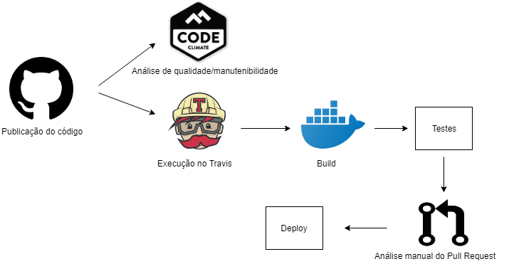

# Pipeline de DevOps

## Histórico de Versão

|Versão|Data|Descrição|Nome|
|---|---|---|---|
|1.0|16/09/2019|Abertura do documento|William Almeida|

## Introdução

Esse documento tem como finalidade resumir as etapas de DevOps a serem utilizadas no projeto, tanto de integração contínua quanto de deploy contínuo.

## Etapas

### Integração contínua

#### Controle de versão

O GitHub será utilizado para a publicação dos códigos-fontes e o controle da versão dos mesmos. Também é importante para a separação do conteúdo utilizado nos ambientes de desenvolvimento, homologação e produção.

#### Análise de Qualidade

O CodeClimate será utilizado como ferramenta de análise da qualidade e manutenibilidade do código, consirando aspectos como complexidade, tamanho de métodos, trechos duplicados e outros. Isso será utilizado na avaliação manual do futuro pull request.

#### Build e testes

O Travis-CI será utilizado para a execução dessa etapa. Após a contrução dos containers são executados os testes planejados no script:
- testes unitários na api(manage.py test)
- testes unitários no frontend(ng test)

O código só poderá seguir para o pull request ao passar sem erros pelo script.

#### Análise do Pull Request
Nessa etapa o código deverá ter passado pela análise de qualidade e também pelos testes unitários requeridos. Se as duas análises derem resultados positivos então será requisitado que algum membro da gerência revise o código manualmente, para evitar problemas com merges e/ou trechos de códigos problemáticos/inúteis.

#### Deploy

### Pipeline v1.0

