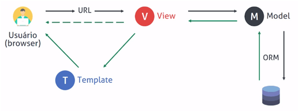
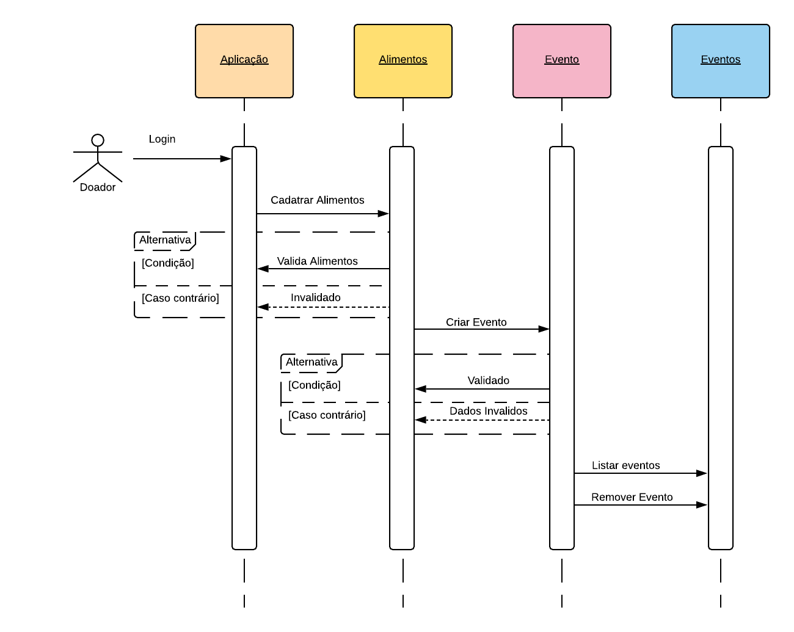
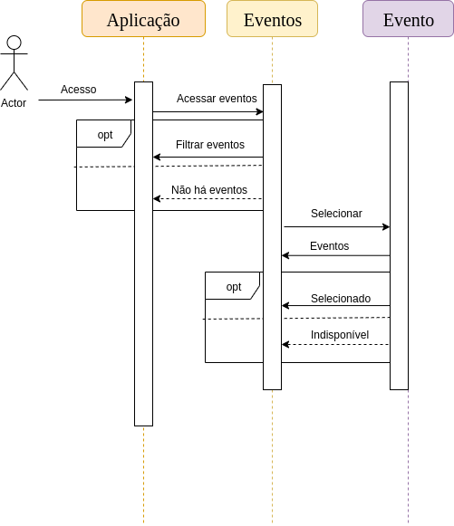
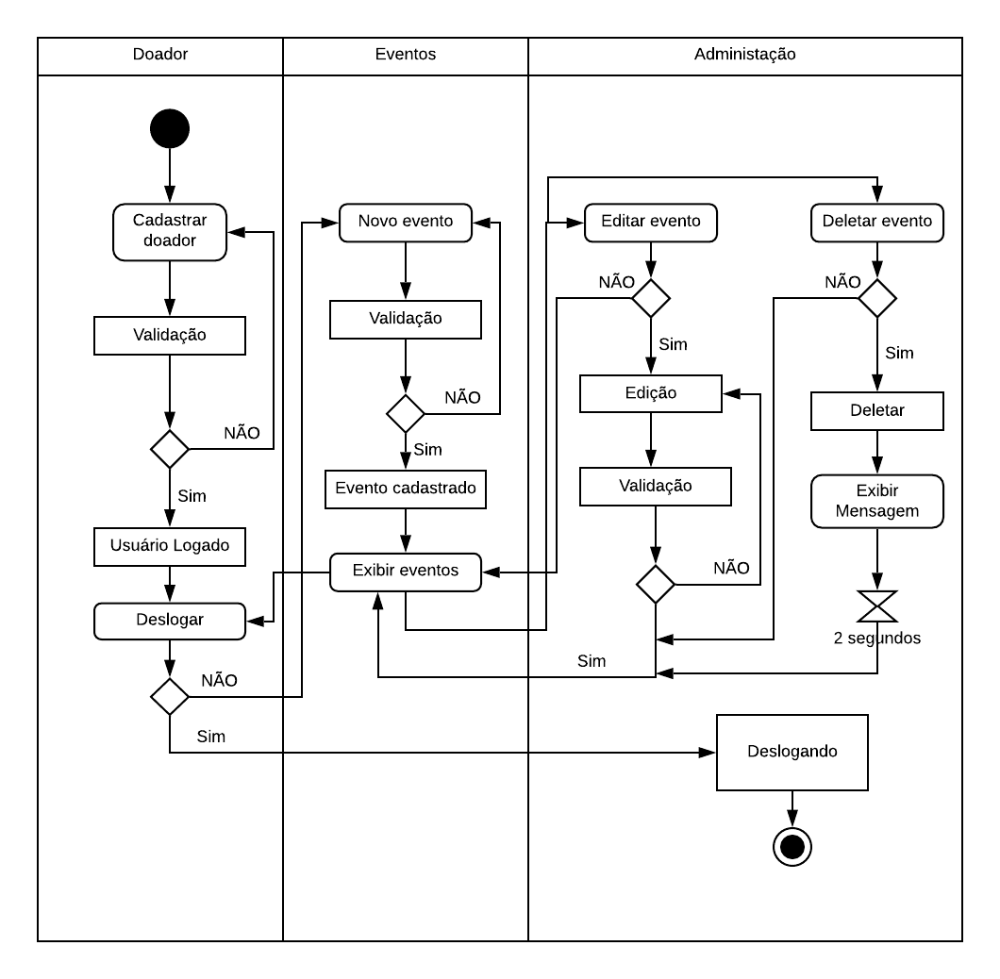
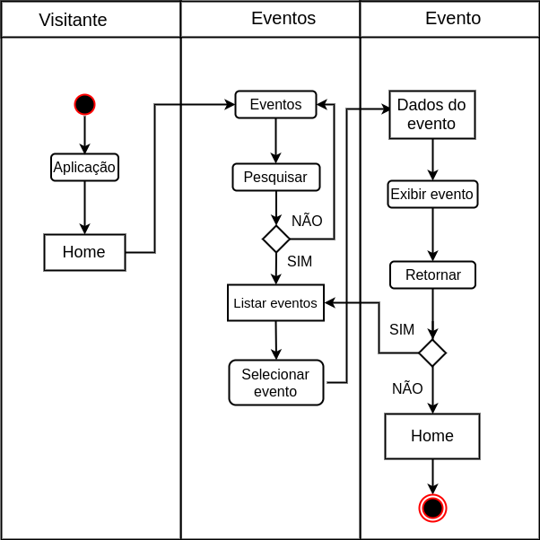
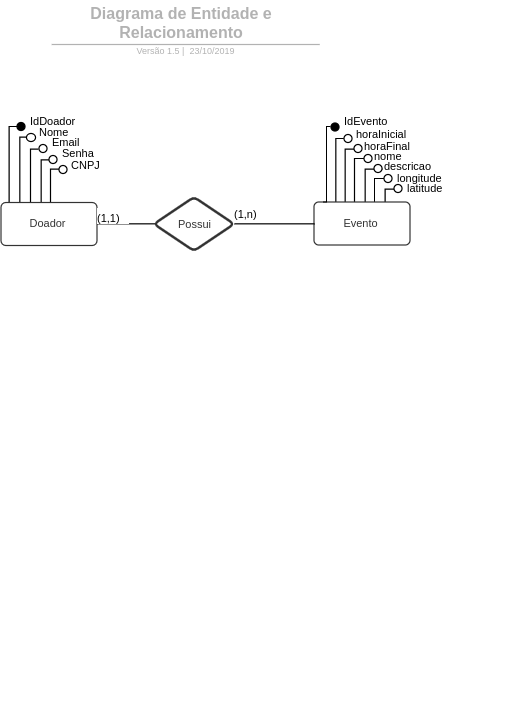
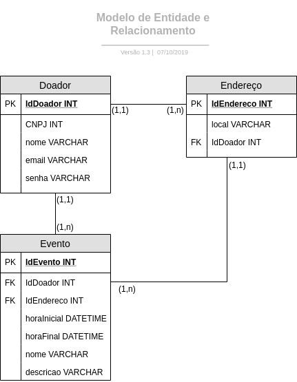

# Documento de Arquitetura

## Historico de versão

 Data | Versão | Descrição | Autor
 ---- | ------ | --------- | -----
19/09/19 | 1.0 | Abertura do documento, criação da introdução| Lucas, Geraldo
20/09/19 | 1.1 | Adiciona Requisitos mínimos dos sistemas | Giovanna
21/09/19 | 1.2 | Adiciona visão de dados | Giovanna
21/09/19 | 1.3 | Adiciona introdução e representação de arquitetura| Geraldo
22/09/19 | 1.4 | Atualiza introdução e representação de arquitetura| Geraldo
21/09/19 | 1.5 | Adiciona diagrama de sequência doador| Lucas
23/09/19 | 1.6 | Adiciona metas e restrições de arquitetura| Bruna
23/09/19 | 1.7 | Adiciona diagrama de casos de uso| Bruna
24/09/19 | 1.8 | Adiciona diagrama sequência visitante| Lucas
24/09/19 | 1.9 | Adiciona diagramas atividades| Lucas
24/09/19 | 2.0 | Adiciona visão lógica | Hugo
20/10/19 | 2.1 | Refatora tópico "Requisitos funcionais" | Bruna
22/10/2019 | 2.2 | Refatora tópicos "Requisitos funcionais" e "Confiabilidade" | Rafaella
23/10/19 | 2.3 | Substitui diagrama de casos de uso | Bruna

## Índice

1. [Introdução](#1)
    1. [Finalidade](#1.1)
    2. [Escopo](#1.2)
    3. [Definições, acrônimos, abreviações](#1.3)
2. [Representação da arquitetura](#2)
    1. [Back-end](#2.1)
        1. [MVC](#2.1.1)
        2. [MTV](#2.1.1)
    2. [Front-end](#2.2)
3. [Metas e Restrições de Arquitetura](#3)
4. [Visão de casos de uso](#4)
5. [Visão lógica](#5)
    1. [Diagramas significativos](#5.1)
        1. [Diagrama de classes](#5.1.1)
        2. [Diagrama de colaboração](#5.1.2)
        3. [Diagrama de pacotes Django](#5.1.3)
        4. [Diagrama de pacotes Angular](#5.1.4)
6. [Visão de implantação](#6)
    1. [Diagrama de implantação](#6.1)
7. [Diagrama de sequência](#7)
    1. [Diagrama de sequência doador](#7.1)    
    2. [Diagrama de sequência visitante](#7.2)
8. [Diagrama de usuário](#8)
    1. [Diagrama de atividades doador](#8.1)
    2. [Diagrama de atividades visitante](#8.2)
9. [Visão de implementação](#9)
    1. [Finalidade](#9.1)
    2. [Diagramas significativos](#9.2)
        1. [Diagrama de componentes](#9.2.1)
10. [Visão de dados](#10)
    1. [Diagrama entidade-relacionamento](#10.1)
    2. [Diagrama lógico](#10.2)
        1. [Diagrama lógico modelado](#10.2.1)
        2. [Diagrama Lógico Gerado pelo Django](#10.2.2)
11. [Qualidade](#11)
    1. [Requisitos funcionais](#11.1)
    2. [Requisitos não funcionais](#11.2)
    3. [Requisitos para plataformas específicas](#11.3)
    4. [Usabilidade](#11.4)
    5. [Confiabilidade](#11.5)
    6. [Desempenho](#11.6)
    7. [Suportabilidade](#11.7)
    8. [Restrições de design](#11.8)
    9. [Requisitos de Sistema de Ajuda e de Documentação de Usuário On-line](#11.9)
    10. [Interfaces de Hardware](#11.10)
12. [Requisitos Mínimos dos Sistemas](#12)
    1. [Sistema executar o projeto](#12.1)
    2. [Servidor de Banco de Dados e Servidor Web](#12.2)
        1. [Servidor de Banco de Dados](#12.2.1)
            1. [SQLite](#12.2.1.1)
        2. [Servidor Web](#12.2.2)
13. [Referências](#13)

# Introdução 

## Finalidade 
Este documento tem como finalidade apresentar a arquitetura do projeto **FoodCare**, para registrar decisões relacionadas ao projeto através de diversas visões. O documento é dividido da seguinte forma: primeiramente a representação da arquitetura da solução é apresentada, em seguida metas e restrições desta arquitetura e por fim as visões sobre elementos da arquitetura.
## Escopo 
Este documento apresenta as características arquiteturais do projeto **FoodCare**, descrevendo em detalhes a soluções arquiteturais determinadas para o projeto, de forma a servir como base para o desenvolvimento do projeto pelos desenvolvedores de software alocados para o projeto.
## Definições, acrônimos, abreviações 
**MVC** - Model View Controller

**MTV** - Model Template View

**Django** - Framework da linguagem python para a construção rápida de aplicativos web, fornecendo componentes prontos e com fácil uso.

**HTTP** - Prototocolo de comunicação utilizado para sistemas de informação.

**REST** - Ferramenta que auxilia a utilização do protocolo http.

**Angular** - Framework de front-end que visa aumentar a produtividade no que diz respeito ao ao front-end do projeto.

**Docker** - Ferramenta utilizada para modularizar os processos do desenvolvimento do software para eliminiar as inconsistências do ambiente de desenvolvimento.

**PWA** - Progressive Web App (PWA) é um termo usado para denotar aplicativos da web que usam as últimas tecnologias da web. Os aplicativos da web progressivos são páginas web (ou sites) tecnicamente regulares, mas podem aparecer ao usuário como aplicativos tradicionais ou aplicativos móveis (nativos).

**FoodCare** - Aplicação web, desenvolvida em Django REST e Angular, que tem como objetivo aproximar pessoas que querem doar com pessoas que desejam receber, estimulando doações, tendo em vista a quantidade de comida que é desperdiçada todos os dias.

# Representação da arquitetura 

## Back-end 

O sistema faz uso do Framework Django (versão 2.2.2), que faz uso do padrão MVC. No entanto, tal plataforma possui uma interpretação singular em relação à organização de camadas. O indicado é considerar que a própria plataforma faz o papel da camada de controle, enquanto a camada de Modelo e de Visão devem ser adaptadas e reinterpretadas conforme o necessário. Por este motivo, ainda que o Django implemente o MVC, considera-se que o padrão de camadas externalizado pela plataforma é o MTV (Model-Template-View). Para auxiliar no protocolo http utilizamos a ferramenta REST.
A utilização de uma arquitetura em camadas é interessante por proporcionar uma clara separação de responsabilidades no código, proporcionando reusabilidade, e reduzindo o esforço de manutenção. Os conceitos de MVC e MTV serão apresentados nas seções seguintes.

### MVC 

Padrão arquitetural MVC.

* **Model:** camada de acesso a base de dados, é responsável pela leitura, manipulação e validação dados;

* **Controller:** é responsável por manipular e validar as requisições do usuário, traduzindo em comandos enviados para enviados para a Model e/ou View .

* **View:** camada de interface com o usuário, responsável pela representação dos dados;
### MTV 
 

Padrão arquitetural MTV.

* **Model:** segue a mesma definição da model no MVC;

* **Template:** segue a mesma definição da view no MVC;

* **View:** segue a mesma definição da controller no MVC.

## Front-end 
O sistema faz uso do angular 8, que traz vantagens como: componetização, módulos específicos para configurar PWA, sistema de rotas de páginas, framework material para parte de design do site.
# Metas e Restrições de Arquitetura 
Restrição|Descrição
:---------:|:----------
Linguagem|O sistema será desenvolvido utilizando a linguagem Typescript para o front-end e a linguagem Python para o back-end.
Plataforma|Será utilizado o framework Angular para o front-end e o framework Django para o back-end.
Segurança|Todas as senhas cadastradas serão criptogradas, para uma maior segurança para o usuário.
Persistência|Será utilizado o banco de dados SQLite3 para a persistência dos dados.
Arquitetura|Será feita uma arquitetura de microserviços, já que facilita a escalabilidade do sistema e simplifica o deploy de componentes separados do sistema.
Portabilidade|O projeto é uma aplicação web, o que facilita a portabilidade entre sistemas, sendo acessado através do navegador. Entretanto, não possui portabilidade para mobile.
Distribuição|Sempre será disponibilizada ao usuário a última versão da API, já que a distribuição sempre ocorrerá assim que a nova versão do software é enviada para produção.
Reuso|A utilização dos frameworks Django e Angular certificam um bom reuso devido à padronização da criação de componentes do código.
# Visão de casos de uso 

# Visão lógica  

## Diagramas significativos 

### Diagrama de classes 
O diagrama de classes é a representação gráfica que descrevea estrutura de um sistema. Contendo seus atributos, métodos, classes e afins.

Seguindo o modelo UML(Unfied Modeling Language), o nosso sistema se descreve em sua estrutura de funcionamento, relacionando seus subsistemas dependentes.

Temos como principais classes:

* Usuário: capaz de criar eventos e detentor de um endereço.
* Endereço: automaticamente gerado baseado na localização do doador no momento de criação do evento.
* Evento: contém informações do usuário, endereço e o tipo de alimento a ser doado.
* Alimento: utilizado como referência física do produto a ser doado e especificado quanto à: quantidade e validade. 

### Diagrama de colaboração 
O diagrama de colaboração exibe as interações entre os objetos e suas dependências dentro de um sistema.

### Diagrama de pacotes Django 
O Diagrama de pacotes, ou diagrama de módulos, definido pela UML, descreve os pacotes ou pedaços do sistema divididos em agrupamentos lógicos mostrando as dependências entre eles. Este diagrama é utilizado para ilustrar a arquitetura de um sistema mostrando o agrupamento de suas classes. O Django organiza seus componentes em apps que possuem arquivos referentes a cada aplicação.

* apps: cada app tem uma pasta com as suas models, views, formulários, testes e arquivos estáticos.

    * migrations : pasta com as migrações para o banco de dados.

    * static : pasta com arquivos CSS, JavaScript e imagens.

    * tests : arquivos de testes refente ao app.

    * locale : traduções referentes ao app.

    * models : arquivos de models do app.

    * views : arquivos de views do app.

    * admin : arquivo de conexão do app com o admin.

    * urls.py : arquivo que mapeia as as views com templates de cada app

    * _init_ : arquivo que transforma o app em um pacote python.

    * apps : mapeia a pasta que o contém como um app.

    * utils : arquivos de validação dos apps.

* config : pasta com as configurações do projeto Django.

    * urls.py : inclui todos os URLs.py dos apps.

    * _init_ : arquivo que transforma as configurações em um pacote python.

    * settings : arquivos com as configurações básicas da aplicação.

    * wsgi : especificação para uma interface simples e universal entre servidores web e aplicações web.

* manage.py : arquivo criado automaticamente pelo Django para gerênciamento de comandos.

* docs : documentação da aplicação.

* compose : pasta com arquivos do docker.

* utility : arquivos para o auxílio na instalação do software.

* requirements : organiza todos os pacotes/componentes que a aplicação utiliza em arquivos. 

### Diagrama de pacotes Angular 
Os a relação de pacotes utilizados do Angular compõe:

* app.component.css: Arquivo responsável pelo estilo do nosso módulo.

* app.component.html: Arquivo HTML do nosso componente App, segue o mesmo pensamento que os arquivos de estilo.

* app.component.spec.ts: Arquivo de teste do nosso componente.

* app.component.ts: possui a mesma responsabilidade os Constrollers.

* app.module.ts: O Angular é um framework modular, ele precisa de um ou mais módulos para que possamos gerenciar os nossos componentes.

* Assets: Esse diretório nos permite trabalhar com arquivos extras a nossa aplicação, como as nossas imagens.

* Environments: Temos dois arquivos .ts, um para o nosso ambiente de produção e um outro para o nosso ambiente de desenvolvimento.

* index.html: Esse seria o nosso arquivo root, dentro dele rodamos a nossa SPA (Single Page Application).

* main.ts: Esse é o arquivo principal da nossa Solution. Ele vem definido dentro do nosso arquivo angular-cli.json, esse seria o bootstrap da nossa aplicação.

* polyfills.ts: traduz o código para diferentes navegadores web.

<!-- # Visão de implantação  
## Diagrama de implantação 
 -->

# diagrama de sequência 
## diagrama de sequência doador 

## diagrama de sequência visitante 

# diagrama de usuário 
## diagrama de atividades doador 

## diagrama de atividades  visitante

<!-- # visão de implementação 
## finalidade 
## diagramas significativos 
### diagrama de componentes  -->

# visão de dados 
## diagrama entidade-relacionamento 

## diagrama lógico 
### diagrama lógico modelado 

# 11. Qualidade  
Os seguintes itens conferem ao sistema aspectos de qualidade, bem como a descrição da abordagem realizada para satisfazer esses aspectos. São estes aspectos, legais e reguladores, como as normas estabelecidas para bom funcionamento do sistema, atributos de qualidade, como padrões de usabilidade, confiabilidade, desempenho e suportabilidade.

## 11.1 Requisitos funcionais 
Identificador | Requisito funcional | Descrição
------- | ------- | -------
RF001 | Cadastrar usuário | O sistema deve permitir que o usuário inclua infomrações para cadastro.
RF002 | Filtrar categorias de alimentos | O sistema deve permitir que o usuário filtre os eventos que deseja visualizar de acordo com o tipo de alimento disponível em cada evento.
RF003 | Pesquisar evento | O sistema deve permitir que o usuário pesquise nominalmente o evento de seu interesse.
RF004 | Consultar evento | O sistema deve permitir que o usuário consulte as informaçẽos específicas dos eventos, como local, hora, data e o tipo de alimento disponibilizado.
RF005 | Listar eventos | O sistema deve permitir ao usuário escolha a visualização dos eventos em forma de lista.
RF006 | Validar dados cadastrais do usuário | O sistema deve ser capaz de validar os dados do usuário no momento em que o login for realizado.
RF007 | Enviar email | O sistema deve permitir que o usuário envie um email para o admin do site.
RF008 | Criar evento | O sistema deve permitir que o usuário insira informações para criar eventos de doação, como nome e data do evento, quantidade e tipo de alimento disponibilizado.
RF009 | Alterar evento | O sistema deve permirtir que o usuário altere o evento criado, editando informações.
RF010 | Excluir evento | O sistema deve permitir que o usuário exclua um evento criado. 
RF011 | Cadastrar admin | O sistema deve permitir cadastro de um administrador do site.

## 11.2 Requisitos não funcionais 
Identificador | Requisito não funcional | Descrição
-----| ------| ------
RNF001 | Retornar mensagem de sucesso | Imeadiatamente após o cadastro do usuário, o sistema irá retornar uma mensagem de cadastro completado com sucesso.
RNF002 | Mensagem de erro | Caso o usuário tente fazer login sem que haja cadastro, uma mensagem de erro será mostrada.
RNF003 | Retornar à Home | A página retornará para a interface Home sempre que houver click sobre o nome da página.

## 11.3 Requisitos para plataformas específicas 
Identificador | Navegador Web | Modelo | Versão
------- | ------- | ------- | ------ 
RNF001 | Internet Explorer | Qualquer dispositivo | Versão 10 ou superior.
RNF002 | Chrome | Qualquer dispositivo | Última versão
RNF003 | Mozilla Firefox | Qualquer dispositivo | Versão mais recente ou imediatamente anterior
RNF004 | Opera | Qualquer dispositivo | 11 ou superior.
RNF005 | Safari | Qualquer dispositivo | Versão 6 ou superior.

## 11.4 Usabilidade 
A usabilidade definida como a efetividade, a eficiência e a satisfação com que usuários específicos atingem objetivos específicos em ambientes particulares, visa facilitar a utilização de uma interface pelo usuário sem perder a interação de suas funcionalidades com o sistema.

* Facilidade de aprendizado: a utilização do sistema requer pouco treinamento;
* Fácilidade de memorização: o usuário deve lembrar como utilizar a interface depois de algum tempo;
* Consistência e Padronização: O sistema deve manter padronizada a interface independente do tipo de usuário, apenas alterando as funcionalidades disponíveis para cada um;
* Eficiência: O sistema deve fornecer acesso a qualquer funcionalidade de forma rápida e eficiente;
* Design Simples: O sistema deve ter ícones intuitivos. Para cada tipo de usuário haverá um certo nível de funcionalidades disponíveis;
* Minimizar os erros: caso aconteçam erros, a interface deve avisar o usuário e permitir a correção de modo fácil.

## 11.5 Confiabilidade 
Qualidade do sistema que nos permite confiar, justificadamente, no serviço oferecido.

* Disponibilidade: O sistema estará disponível no modo 24/7 (24 horas por dia, 7 dias por semana).
* Segurança e Privacidade: O sistema deve assegurar a segurança e privacidade dos dados gerados, armazenando senhas e dados sensíveis de forma segura. O sistema deve ser transparente quanto às informações coletadas referentes a dados pessoais do usuário.

## 11.6 Desempenho 

* Tempo de Resposta: O aplicativo tem de responder às ações do usuário de imediato.
* Modo de degradação: Se o sistema estiver sofrendo com algo que degrade o site, como a internet com sinal fraco, terá páginas que não serão carregadas.
* Utilização de Recursos: OS X 10.9 ou superior, Windows 7 ou superior, Versão 6 ou superior.
* Adequação de interface: O site será capaz de se adequar à tela ao dispositivo utilizado pelo usuário, utilizando Progress Web Apps (PWA).

## 11.7 Suportabilidade 
O usuário será capaz de utilizar o sistema através de um navegador de internet, sem a necessidade de qualquer software personalizado no computador pessoal. O site é uma aplicação desenvolvida como *PWA (Progressive Web App)*, possibilitando adequação da tela para uso em qualquer disposito eletrônico. O servidor terá suporte para 100.000 cadastros de usuário.

## 11.8 Restrições de design 
* O nome da página sempre estará no topo do layout e sempre que clicado, direcionará à página para a interface inicial (home)
* Para criar um novo evento, o usuário terá que passar pela tela de login.

## 11.9 Interfaces de Hardware 
O software oferece suporte aos dispositivos apresentados abaixo.

* Smartphones.
* Computadores Notebooks.
* Computadores Desktop.

# Requisitos Mínimos dos Sistemas 
## Sistema executar o projeto 

* Processadores: processador Intel Atom® ou processador Intel® Core ™ i3
* Espaço em disco: 1 GB
* Sistemas operacionais: Windows * 7 ou posterior, macOS e Linux
* Versões Python *: 2.7.X, 3.6.X

## Servidor de Banco de Dados e Servidor Web 

Com os requisitos a seguir o esse servidor deve suportar cerca de 10 000 usuários, caso tenha necessidade de atuar com mais usuários o estudo deve ser feito novamente.

### Servidor de Banco de Dados 
* Requirido
    * Processador = Xeon E5 server family
    * CPU = 2 x 4 cores
    * Memoria RAM = 16 GB
    * Backup = External Hard Disk, HDD
* Futura expansabilidade
    * CPU = 1 x 4 sockets
    * Espaço de Disco = 16GB à 1.5TB

#### SQLite 

Windows | Linux/ Mac
------- | -----
XP Service Pack 3/2003 Service Pack 2 ou maior. |  Java Runtime Environment (JRE) 1.5 ou maior.  
.NET Framework 2.0 ou maior. | 500 MB RAM  
500 MB RAM |
### Servidor Web 

A escolha do servidor web é de grande importancia pois afeta diretamente a experiencia do usuário. Deve ser um equilíbrio de CPU e de RAM.

* Processador: Intel I7-3770
* Memoria Ram: 16GB
* HDD: 146 GB 15K 12GBPS 128MB Cache

# Referências 

* Requisitos de hardware. Disponível em <http://www.stansoftware.com/hardware-requirements/>. Acesso em 20 de setembro de 2019.
* Requisitos de sistema. Disponível em: <https://software.intel.com/en-us/distribution-for-python/system-requirements>. Acesso em 20 de setembro de 2019.
* Requisitos de sistema. Disponível em: <http://cdn.cdata.com/help/DEA/rsb/pg_startrequirementsrsb.htm>. Acesso em 20 de setembro de 2019.
* Get Started with Docker. Disponível em <https://www.docker.com/get-started>
* Software Architecture: MVC Design Pattern, Medium. Disponível em: //medium.com/@dennisvera.z/software-architecture-mvc-design-pattern-ceae5d5083d7)).
* Django's Structure – A Heretic's Eye View, The django book. Disponível em: <https://djangobook.com/mdj2-django-structure/>
* O que é PWA (Progressive Web App). Disponível em <https://vizir.com.br/2017/08/o-que-e-pwa-progressive-web-app-porque-isso-pode-aumentar-seus-resultados-mobile/>
