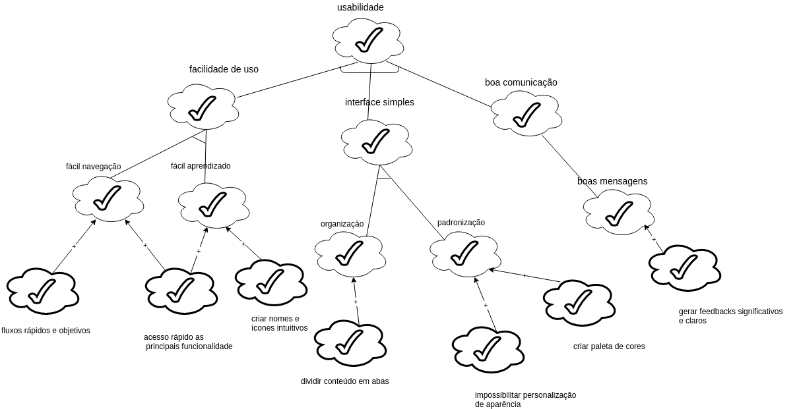
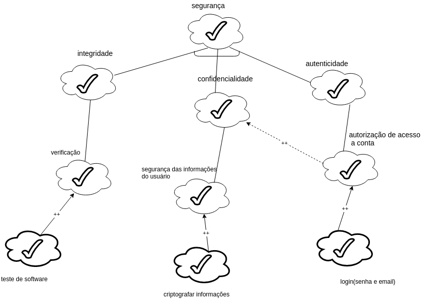
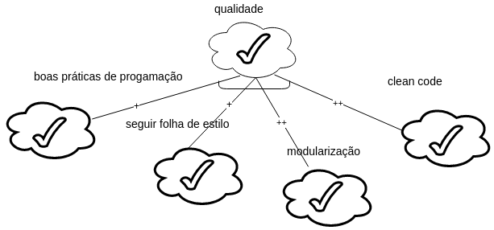
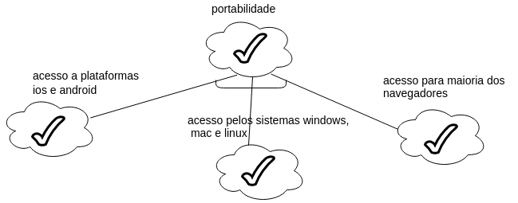

# Especificação Suplementar

# Histórico de Versão

|Data|Versão|Descrição|Autores|
|----|----|----|----|
|27/09|1.0|Abertura do documento|Geovanne Santos|
|29/09|1.1|Adiciona diagramas de nfr|Geovanne Santos|

## 1. Introdução

### 1.1 Finalidade

Este documento tem como objetivo abordar aspectos técnicos, legais e demais requisitos sobre a aplicação FoodCare, que não foram abordados nos demais documentos, tais como: documento de visão e de arquitetura.

### 1.2 Escopo
Os requisitos aqui elucidados fazem parte do processo de desenvolvimento da aplicação FoodCare, que auxiliará pessoas a encontrarem locais que esteja oferecendo comida.  
Primeiro estão definidos os requisitos não funcionais e em seguida alguns desses requisitos estão dispostos em um diagrama NFR(Non-Functional Requirement).   
O NFR Framework é uma abordagem orientada a processos, onde os requisitos não-funcionais são explicitamente representados como metas a serem obtidas e como serão obtidas.

## 2. Usabilidade

O sistema deverá presar por simplicidade e acesso intuitivo, tendo em vista sua importância para o ajustamento e uma utilização adequada pelos usuários da aplicação. Para alcançar tal meta, a aplicação deve conter um design limpo, de fácil vizualização e entendimento, com acesso rápido e intuitivo a informações e funcionalidades importantes, sempre utilizando-se uma linguagem de fácil entendimento e compreensão.  

### 2.1 Metas de Usabilidade

- Eficaz: O sistema deve fazer o que eu espero que faça, alcance seu objetivo.
- Eficiente: Velocidade de uso.
- Segurança: Proteção ao usuário contra condições perigosas (físicas) e situações indesejáveis (medo).
- Utilidade: Oferece o tipo certo de funcionalidade.
- Aprendizado: Fácil de aprender.
- Memorização: Fácil de lembrar como se usa.
- Prevenções de erros: Evitar inserção de dados errôneos ou inadequados.
- Diagnóstico de erro fácil para o usuário: Mensagens de erro claras e de fácil entendimento para o usuário.
- Visibilidade de estado do sistema: Deixar claro ao usuário o que está acontecendo em tempo real.

## 3. Disponibilidade

O sistema deverá ter alto nível de disponibilidade considerando a necessidade de acesso contínuo e frequente à aplicação. Tal requisito gerará um contexto em que falhas e bugs do sistema tenham a possibilidade de serem corrigidas rapidamente. O sistema deve estar disponível 24/7.

## 4. Portabilidade

O sistema deverá funcionar nos navegadores de internet Google Chrome, Mozilla Firefox e Apple Safari e em dispositivos capazes de acessar a internet, que suportem os navegadores descritos e, também, que estejam equipados com sistema Windows, Linux, Mac, Android e iOS, ou seja,se adaptando visualmente à esses sistemas.

## 5. Desempenho

O sistema deverá processar as requisições de acesso do usuário de maneira eficiente e fluída, contribuindo para a qualidade e satisfação do cliente, aguentar no mínimo 2000 clientes utilizando o site simultaneamente.

## 6. Interoperabilidade

O sistema possuirá conexão com banco de dados para armazenar informações de usuários cadastrados e também deverá salvar suas informações remotamente, fora do dispositivo do usuário.

## 7. Segurança

As informações de um usuário somente serão acessadas por ele mesmo, só ele poderá criar um evento em nome de sua empresa. O sistema atenderá as políticas de privacidade do usuário, que garantem a proteção dos seus dados e a visualização restrita, e buscará incluir boas práticas de segurança de informações como segurança das operações e comunicações, controle de acesso.

## 8. Restrições de design

### 8.1 Interface

- Minimalista
- Intuitivo
- Informações objetivas

### 8.2 Arquitetura

- Model-View-Template(Django-Rest)
- Template-Component(Angular)

### 8.3 Ferramentas

- Travis(Desenvolvimento)
- CodeClimate(Desenvolvimento)
- Docker(Desenvolvimento)
- GitHub(Desenvolvimento)
- ZenHub(Gerenciamento)
- Telegram(Gerenciamento)
- Google Drive(Gerenciamento)

## 9. Diagramas NFR

### Diagrama de Usabilidade

### Diagrama de Segurança

### Diagrama de Qualidade

### Diagrama de Portabilidade

