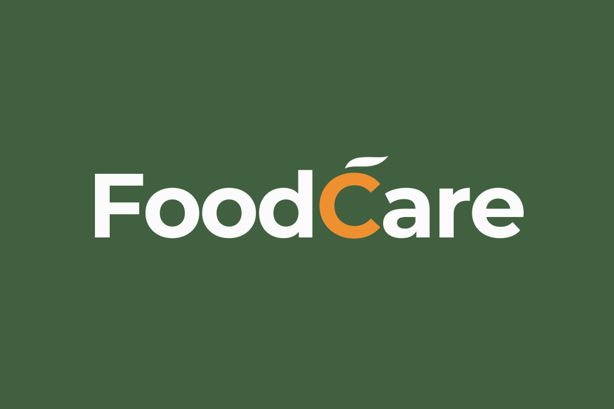
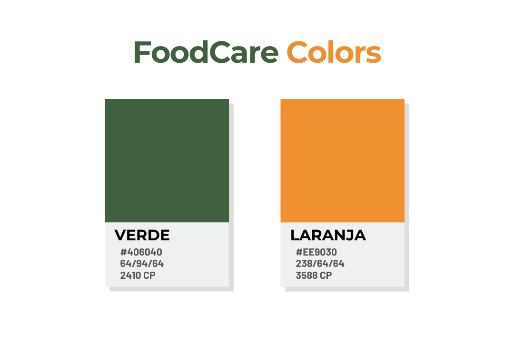
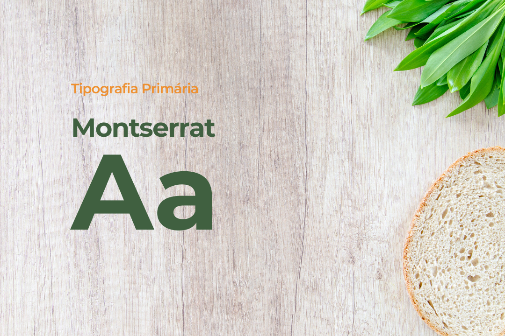
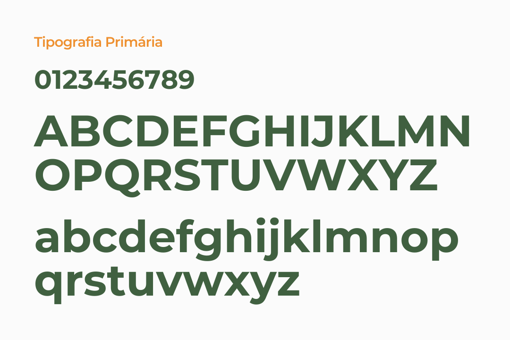
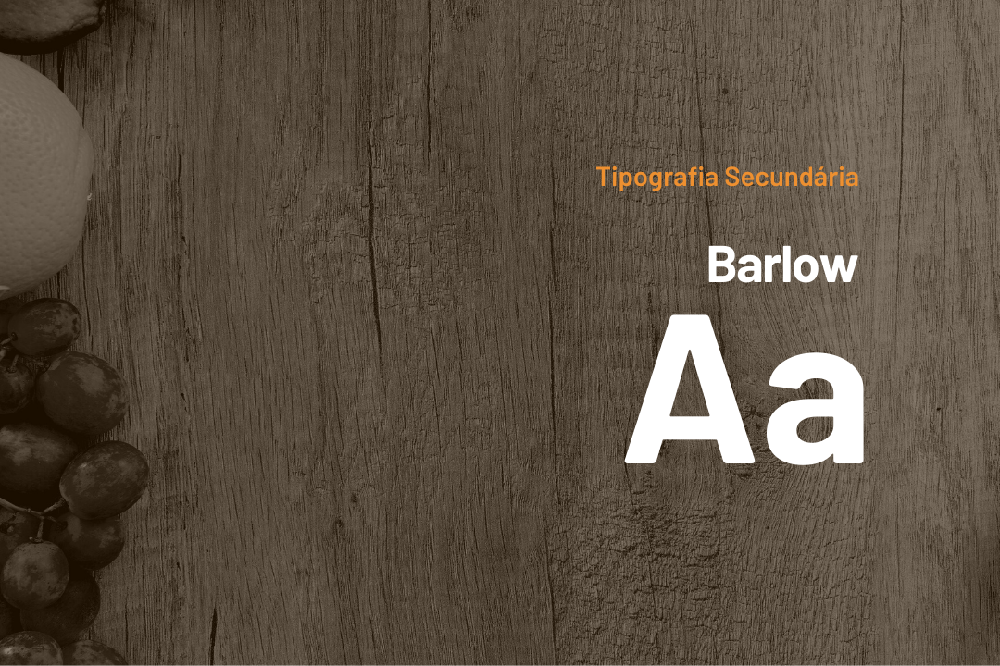
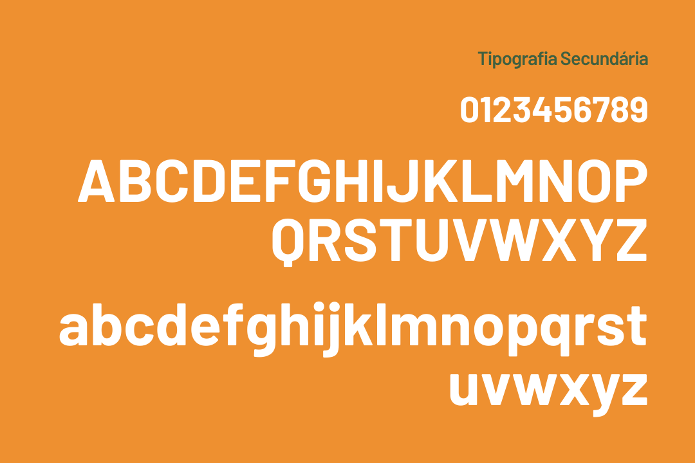

# Identidade Visual

## Histórico de Versão

|Versão|Data|Descrição|Nome|
|---|---|---|---|
|1.0|14/09/2019|Abertura do documento|Igor Aragão|
|2.0|20/11/2019|Atualiza identidade visual do projeto|Igor Aragão|

## Introdução

Este documento visa apresentar a Identidade Visual do projeto FoodCare.

## FoodCare Visual ID

Faça o download da [Identidade Visual do FoodCare em PDF](../assets/IDVisual-FoodCare.pdf).

### Versões anteriores

Confira a [versão 0.1](old/id-visual-old.md) da Identidade Visual do FoodCare.

## Referências

Canva. Canva. Disponível em <https://www.canva.com>. Último acesso em 20/11/2019.

Fonts Google. Google. Disponível em <https://fonts.google.com/>. Último acesso em 15/09/2019.

Adobe Color. Adobe. Disponível em <https://color.adobe.com/pt/create>. Último acesso em 15/09/2019.
