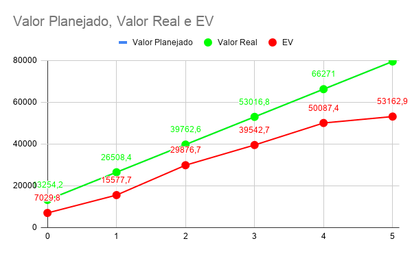
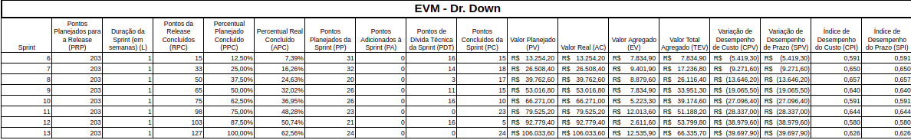
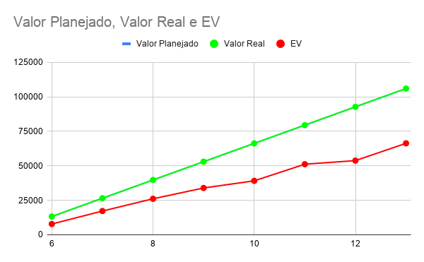

# EVM

## Histórico de Versão

|Versão|Data|Descrição|Nome|
|---|---|---|---|
|0.1|26/11/2019|criação da evm da release 1|Geovanne Santos Saraiva|
|0.2|27/11/2019|criação da evm da release 2|Geovanne Santos Saraiva|

## EVM Agile

O EVM (Earned Value Management ou Gerenciamento de Valor agregado) se trata de uma técnica da gestão tradicional de projetos que é usada para medir a saúde de um projeto. Essa técnica foi adaptada para projetos agéis a fim de auxiliar a equipe de gestão a verificar métricas e avaliar entregas em projetos que seguem esta metodologia, e que enfretam alguns problemas como:

- Escopo aberto;
- Falta de visibilidade em entregas e custos;

### Dados Fixos

#### release 1

|Identificador|Descrição|Valor|
|---|---|---|
|BAC|	Orçamento disponível para a primeira release	|R$ 79525,2|
|L|Tamanho da sprint em dias|	7|
|PS|Total de sprints planejadas|6|
|PRP|	Pontos planejados para a primeira release|181|

#### release 2

|Identificador|Descrição|Valor|
|---|---|---|
|BAC|	Orçamento disponível para a primeira release	|R$ 106033,6|
|L|Tamanho da sprint em dias|	7|
|PS|Total de sprints planejadas|8|
|PRP|	Pontos planejados para a primeira release|203|

### Legenda

|Identificador|	Descrição|
|---|---|
|PRP|	O PRP foi modificado para ser a soma de todos os pontos reavaliados das histórias.|
|RPC|	De forma análoga, o RPC é avaliado como o somatório dos pontos concluídos até a sprint atual.|
|PPC|	Esse valor é o somatório da razão entre a duração da sprint atual sobre o número de sprints da release até a sprint atual.|
|APC|	Esse valor é obtido pela razão entre o RPC da sprint e o PRP.|
|PP|	Pontos que foram planejados para cada sprint.|
|PA|	Funcionalidades novas que foram adicionadas ao projeto/sprint.|
|PDT|	Pontos relacionados a dívidas técnicas deixadas pelas sprints anteriores.|
|PC|	Quantos pontos foram efetivamente completados na sprint.|
|PV|	O valor planejado é obtido através da multiplicação do PPC pelo orçamento do projeto.|
|AC|	É, também, obtido através da multiplicação do PPC pelo orçamento, visto que no projeto ágil o valor real é sempre igual ao planejado.|
|EV|	É resultado da multiplicação da PC pelo orçamento do projeto, divido pelo PRP.|
|TEV|	É o somatório do TEV até aquela sprint.|
|CV|	É a subtração do TEV pelo AC.|
|SV|	É a subtração do TEV pelo PV.|
|CPI|	É a divisão de TEV por AC.|
|SPI|	É a divisão de TEV por PV.|

### Planilha EVM release 1
[Link do documeto no google docs](https://docs.google.com/spreadsheets/d/12XbYox-x53jGSFJjHqkYMSvsLEmUCTIZVg462C6axI0/edit#gid=0)

### Imagem da planilha da EVM 1

Abaixo segue as imagens da EVM para a primeira release, esta que já foi concluída. As informações podem ser melhor vistas no link disponibilizado acima.

##### tabela de dados da evm 1

##### gráfico da evm 1

### Planilha EVM release 2
[Link do documeto no google docs](https://docs.google.com/spreadsheets/d/1Wj-KKK2OqgT-xWlo9CLOnf6XgVcxbwoo933VRXpf5eY/edit?usp=sharing)

### Imagem da planilha da EVM 2

Abaixo segue as imagens da EVM para a segunda release, esta que já foi concluída. As informações podem ser melhor vistas no link disponibilizado acima.

##### tabela de dados da evm 2

##### gráfico da evm 2

### Referências
HiFlex Consultoria. Gerenciamento de valor agregado (EVM) em projetos agéis. Vitor Massari. Acesso em: http://www.hiflex.com.br/v1/gerenciamento-de-valor-agregado-evm-em-projetos-ageis/ codetiburon. Earned Value Management (EVM) for Agile Software Projects. Olga Yatskevich. Acesso em: https://codetiburon.com/earned-value-management-evm-agile-software-projects/
