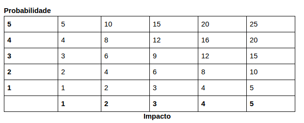

# Histórico de Versão

|Data|Versão|Descrição|Autores|
|----|----|----|----|
|19/09|1.0|Abertura do documento|Geovanne Santos|
|20/09|1.1|Adiciona  Análise qualitativa e quantitativa dos dados|Geovanne Santos|

## Escopo

O plano de risco tem como objetivo descrever quais são os riscos do projeto, como eles serão monitorados e controlados ao longo das sprints, visando entender seus impactos, procurando formas de mitigar esses possíveis riscos.

## Riscos e suas consequências

### Riscos de projeto

| ID | Risco | Consequência |
|---|---|---|
| 1 | Mudança Arquitetural | Gera retrabalho, como alteração nas histórias planejadas, mudanças de infra e mudanças a nível de código |
| 2 | Mudança de Escopo | Alteração no cronograma e refatoração dos requisitos e da documentação |
| 3 | Falha na Comunicação | Gera erros e perdas de informação |
| 4 | Imaturidade na gerência | Diminui qualidade das entregas, aumenta o custo do projeto, afeta o planejamento, atrasando as issues planejadas, exige refatoração de artefatos |
| 5 | Desistência de membros | sobrecarga dos membros remanescentes, redistribuição de tarefas |
| 6 | Descomprometimento da Equipe | Falhas na entrega, desgaste nos membros comprometidos gera falta de qualidade nas entregas |
| 7 | Erro de Priorização | Estimativa de produtividade e refatorações |

### Riscos técnico

| ID | Risco | Consequência |
|---|---|---|
| 8 | Dificuldade com as Tecnologias Adotadas | Não respeito ao prazo e redução da qualidade de entrega |
| 9 | Atraso nas entregas | planejamento não se cumpre e ocorre um aumento do prazo |

### Riscos externo

| ID | Risco | Consequência |
|---|---|---|
| 10 | Greve na Unb | Viabilidade do projeto |
| 11 | Integrante ficar doente | Issue não feita |

### Risco de Produto

| ID | Risco | Consequência |
|---|---|---|
| 12 | Solução não atender as expectativas do usuário final | erro na parte de elicitação de requisitos |

## Análise qualitativa e quantitativa dos dados

A análise qualitativa e quantitativa dos riscos do projeto é feita a partir da probabilidade de ocorrência, do impacto gerado e a partir desses dois valores a análise do grau de risco. As tabelas a seguir mostram como esses valores são definidos.

### Probabilidade

| Probabilidade	| % de certeza | Peso |
|---|---|---|
| Muito baixa |	0 a 20%	| 1 |
| Baixa	| 20 a 40% | 2 |
| Média	| 40 a 60% |	3 |
| Alta | 60 a 80%	| 4 |
|Muito alta	| 80 a 100%	| 5 |

### Impacto

| Impacto	| Impacto sobre o Custo Original (%)	| Peso |
| Nulo	| 0%	| 0 |
| Muito baixo	| 1 a 5% |	1 |
| Baixo	| 5 a 10%	| 2 |
| Médio	| 10 a 15% |	3 |
| Alto	| 15 a 20%	| 4 |
| Muito alto	| Acima de 20%	| 5 |

### O grau de risco é definido pela multiplicação da probabilidade pelo impacto. Conforme tabela abaixo:

Sendo que:

Risco >= 15: Elevado  
5 < Risco < 15: Médio  
Risco =< 5: Baixo

## Análise de riscos

| # |	Descrição |	Probabilidade |	Impacto	| Risco |
|---|---|---|---|---|
| 3	| Falha na Comunicação |	5 |	5	| 25 |
| 1  |	Mudança Arquitetural	| 3	| 5	| 15 |
| 6	| Descomprometimento da Equipe	| 4	| 5	| 20 |
| 8	| Dificuldade com as Tecnologias Adotadas	| 4	| 4	| 16 |
| 2	| Mudança de Escopo	| 3	| 4	| 12 |
|  4 	| Imaturidade na Gerência	| 3	| 4	| 12 |
| 9	| Atraso nas Entregas	| 3	| 4 |	12 |
| 7	| Erro de Priorização	| 3	| 3	| 9 |
| 5	| Desistência de Membros	| 2 |	4	| 8 |
| 10	| Greve na UnB	| 1	| 5	| 5 |
| 11 | Integrante ficar doente | 3 | 2 | 6 |
|12	| A solução não atender as expectativas do usuário final	| 1	| 2	| 2 |

## Planejamento de respostas aos riscos

| ID	| Descrição	| Risco	| Ação	| Descrição da Ação |	Responsável |
|---|---|---|---|---|---|
| 1	| Mudança Arquitetural	| 15	| Mitigar	| Pensamento crítico a respeito da arquitetura e procurando professores e outros suportes para a sua construção	| Equipe completa de EPS |
| 2	| Mudança de Escopo	| 12	| Prevenir	| Validando constantemente com os steakholders	| Product Owner |
| 3	| Falha na Comunicação	| 25	| Previnir	| Realizando sempre todos os rituais e incentivando a comunicação por issue	| Scrum Master |
| 4	| Imaturidade na Gerência	| 12	| Mitigar |	Mantendo o pensamento critico e estratégico a respeito das métricas coletadas e realizando todos os rituais | Todo o time de EPS, mas principalmente o Scrum Master |
| 5	| Desistência de Membros	| 8 |	Aceitar	| Realocação de tarefas	| Scrum Master |
| 6	| Descomprometimento da Equipe	| 20	| Prevenir |	Mostrar o propósito de suas ações, trazendo a sensação de responsabilidade, além de aproximar o time de MDS das tomadas de decisão	| Time de EPS |
| 7	| Erro de Priorização	| 9	| Previnir |	Utilizando técnicas de priorização e estar constantemente reavaliando a priorização	| Product Owner |
| 8	| Dificuldade com as Tecnologias Adotadas	| 16	| Mitigar |	Promover treinamentos, conteúdo online e fornecer suporte para dúvidas e dificuldades de MDS |	Time de EPS, mas principalmente Scrum Master e DevOps |
| 9	| Atraso nas Entregas	| 12 | Prevenir	| Realizando os rituais e observando ao longo da sprint a necessidade de intervenção de EPS	| Scrum Master |
| 10	| Greve na UnB	| 5	| Aceitar	| Reavaliar planejamento do projeto	| Product Owner |
| 11	| Integrante ficar doente	| 6	| Aceitar	| replanejar as tarefas e se possível dar um suporte maior a pessoa doente	| Scrum Master |
| 12 | A solução não atender as expectativas do usuário final	| 2	| Previnir	| Deve ser evitado realizando uma pesquisa de mercado e avaliando o interesse do público alvo na aplicação|	Product Owner |

### O monitoramento dos riscos será feito utilizando o Burndown de Riscos, que estará presente na documentação dos resultados da sprint. Assim como o relatório do que foi feito para que os riscos sejam mitigados.
