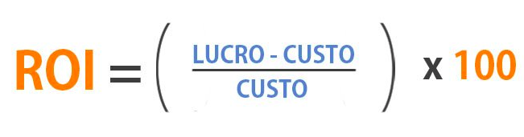

# ROI do Projeto

## Histórico de Versão

|Versão|Data|Descrição|Nome|
|---|---|---|---|
|0.1|03/11/2019|Primeira versão do ROI|Geovanne Santos Saraiva|

## Como fazer o cálculo do ROI

Saber calcular o que é ROI permite mais acesso a dados diversos, os quais auxiliam você e sua equipe no controle dos recursos para investimento. Ou seja, o cálculo foca em saber se há lucro ou prejuízo no negócio.  
Para obter o resultado correto do retorno sobre investimento, você deverá subtrair o lucro do custo inicial e depois dividir o resultado pelo mesmo valor.  
Ao chegar no resultado, é importante saber o quanto isso representa em porcentagem. Para isso, pegue o valor do ROI e multiplique por 100.

## Definindo os valores da fórmula do ROI
- Custo  
O custo foi baseado no documento de [termo de abertura de projeto](https://fga-eps-mds.github.io/2019.2-FoodCare/produto/tap/), que reuniu o custo de aquisição, custo pessoal e de ferramentas, o total desses foi de R$ 185.559,86.

- Lucro  
O lucro será obtido por publicidade, agora existem vários tipos de publicidade, as escolhidas para o site foi publicidade baseada em impressão por anúncios e receita baseada em cliques de anúncio.  
No primeiro modelo basta que um anúncio seja exibido para que o  proprietário do site ou blog seja remunerado, independentemente do número de cliques ou da ocorrência de uma transação posterior. Esse formato normalmente é chamado de CPM (custo por mil), pois o valor do anúncio é definido para “pacotes” de mil impressões. Por exemplo, em um anúncio com CPM de R$ 30,00, o anunciante paga esse valor para cada mil visualizações de seu anúncio. O proprietário do site ganha o equivalente a R$ 0,03 para cada visualização (R$ 30,00 dividido por 1.000).  
No Brasil, 2.5% da população passou fome em 2017. Isso corresponde a 5,2 milhões de pessoas. Estima-se que desses 5 milhões pelo menos 100000 pessoas visitem o site mensalmente, o que daria um total = R$3000,00.  
Agora o modelo de receita baseada em cliques, se o custo por clique dos anúncios (CPC) for de R$ 0,50 (ou seja, para cada clique obtido, o anunciante lhe pagar R$ 0,50), normalmente cerca de 4% do fluxo de usuários de um site clica em anúncios, como o fluxo mensal é de 100000, logo 4000 cliques serão feitos, 4000*0.50 = R$ 2000,00.  
total de lucro mensal seria de R$ 5000,00.

- Resultado  
O resultado do retorno de investimento será feito numa margem de 8 anos, como não se trata de uma empresa que queira ter grandes lucros, mas sim uma plataforma de ajuda humanitária, o retorno imediato não é um requisito de negócio.  
96(meses) * 5000(reais) = R$ 480000  
ROI = [(480000 - 185559)/185.559]*100   
ROI = 200%   
O retorno em 8 anos é de 200%, uma margem bem saudável pro negócio que foi proposto e pro ciclo de vida do projeto. 
