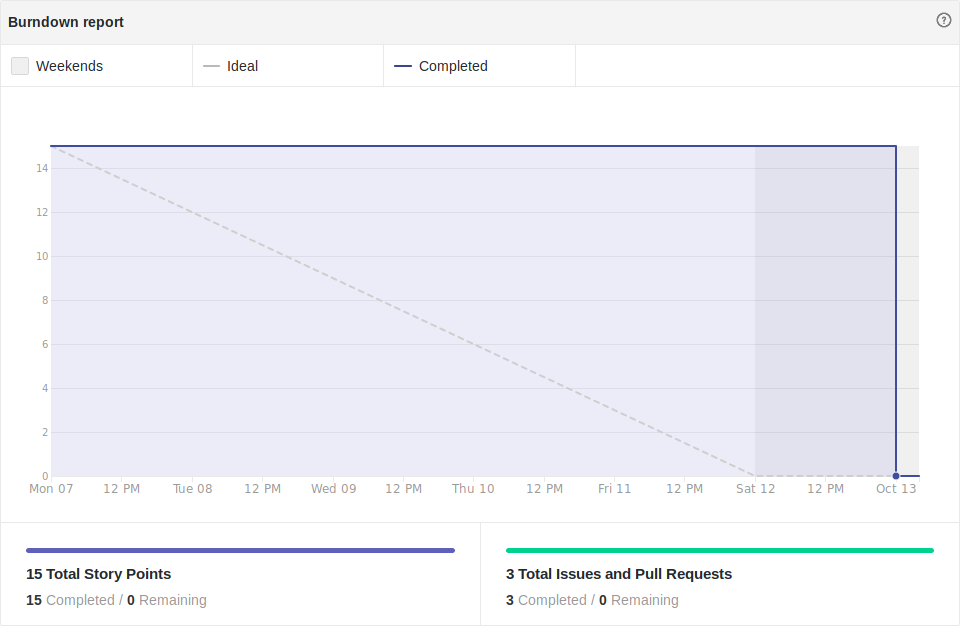
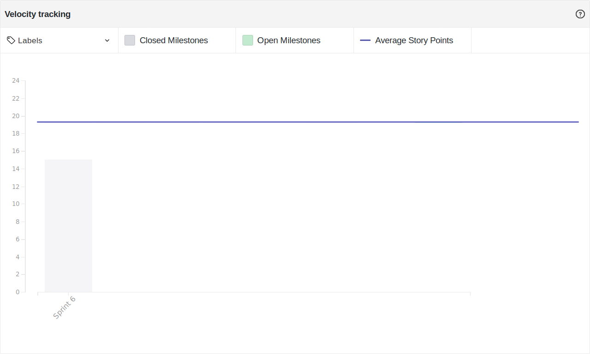

# Resultado Sprint 6

## Sprint Backlog

### Pontuação da Sprint

**Pontos planejados:** 31 pontos  
**Pontos concluídos:** 15 pontos  
**Dívidas geradas:** 16 pontos  

### Issues Entregues

- [#71 Documentar Sprint 6](https://github.com/fga-eps-mds/2019.2-FoodCare/issues/71) - 2 pontos
- [#41 Criar Cadastro e Login de Doador](https://github.com/fga-eps-mds/2019.2-FoodCare/issues/41) - 8 pontos
- [#61 Criar Formulário de Contato](https://github.com/fga-eps-mds/2019.2-FoodCare/issues/61) - 5 pontos

### Dividas técnicas

- [#51 Gerenciamento de eventos](https://github.com/fga-eps-mds/2019.2-FoodCare/issues/51) - 8 pontos
- [#62 Configurar Deploy do Frontend](https://github.com/fga-eps-mds/2019.2-FoodCare/issues/62) - 5 pontos
- [#72 Criar Postmortem R1](https://github.com/fga-eps-mds/2019.2-FoodCare/issues/72) - 3 pontos

## Retrospectiva da Sprint

### Pontos Positivos

- Duas features foram entregues
- Equipe animada após apresentação da R1
- Breve melhoria na comunicação entre os membros de MDS e EPS
- Maior entendimento de MDS à respeito do Travis
- Maior entendimento de MDS à respeito da API

### Pontos Negativos

- Uma dívida técnica não foi resolvida
- Concluímos menos pontos que nossa média (indicada no velocity)

### Sugestão de melhoria

- Não deixar o ânimo gerar comodismo.

## Burndown

Foram 31 pontos planejados nessa sprint, e apenas 15 desses pontos foram entregues, gerando 16 pontos de dívida técnica.

## Velocity

Foram 15 pontos entregues nessa sprint, 8 a mais do que a sprint passada, porém a média do velocity caiu de 20,17 para 19,43.

## Quadro de Conhecimento

Não houveram maiores mudanças no quadro de conhecimento.

## Análise do Scrum Master

Essa sprint teve como objetivo principal, a conclusão das dívidas técnicas de 3 features e um foco secundário em configurar o ambiente de produção de frontend, e acrescentar o Postmortem da R1.

Podemos analisar, pelas métricas, que houve um crescimento na produtividade, caso haja comparação com a sprint anterior, e isso se deve ao maior conhecimento do conteúdo das issues feitas, pelo fato de serem dívidas técnicas, e haver apenas a conclusão do que havia sido iniciado na sprint anterior.  
Porém, a média do velocity caiu, o que indica que foram feitos menos pontos do que já fizemos ao decorrer do projeto. Um fator que pode ter gerado essa queda, pode ser o desvio do foco para a apresentação da release 1, que foi realizada durante a semana dessa sprint.

Foi decidido que para a próxima sprint, Geovanne trocará de função com Igor, sendo Geovanne o novo Product Owner, e Igor passando a ser o Scrum Master. A decisão foi tomada para que haja o melhor compartilhamento de experiência a respeito dos papéis. 
