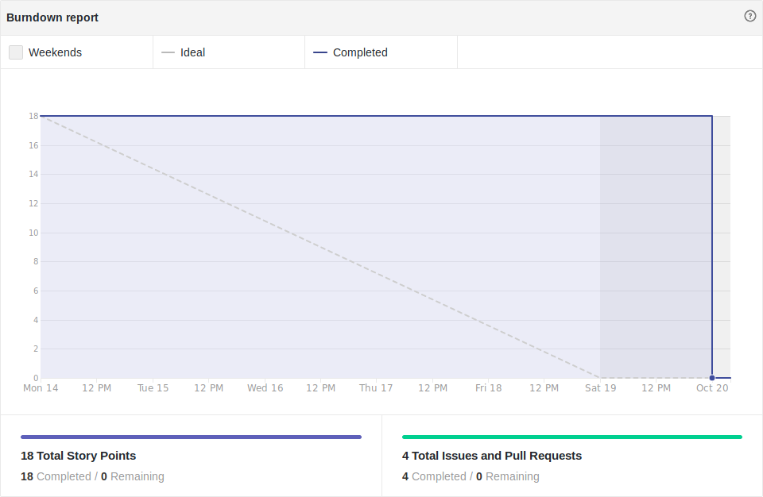

# Resultado Sprint 7

## Sprint Backlog

### Pontuação da Sprint

**Pontos planejados:** 32 pontos  
**Pontos concluídos:** 18 pontos  
**Dívidas geradas:** 14 pontos  

### Issues Entregues

- [#51 Gerenciamento de eventos](https://github.com/fga-eps-mds/2019.2-FoodCare/issues/51) - 8 pontos
- [#62 Configurar Deploy do Frontend](https://github.com/fga-eps-mds/2019.2-FoodCare/issues/62) - 5 pontos
- [#76 Documentar Sprint 7](https://github.com/fga-eps-mds/2019.2-FoodCare/issues/72) - 2 pontos
- [#72 Criar Postmortem R1](https://github.com/fga-eps-mds/2019.2-FoodCare/issues/72) - 3 pontos

### Dividas técnicas

- [#73 Refatorar Documentos de Produto](https://github.com/fga-eps-mds/2019.2-FoodCare/issues/73) - 8 pontos
- [#74 Criar documento ROI](https://github.com/fga-eps-mds/2019.2-FoodCare/issues/71) - 3 pontos
- [#75 Configurar PWA](https://github.com/fga-eps-mds/2019.2-FoodCare/issues/75) - 3 pontos

## Retrospectiva da Sprint

### Pontos Positivos

- As dívidas técnicas foram fechadas
- Deploy do frontend realizado

### Pontos Negativos

- Configurar PWA não é tão fácil quanto parece
- Queda de produtividade após R1
- Gerando muitas dívidas técnicas em cada sprint
- Falta de comunicação entre a equipe MDS
- Outras matérias tirando o foco da equipe

### Sugestão de melhoria

- Diminuir pontos planejados para evitar dívidas técnicas

## Burndown

Foram 32 pontos planejados nessa sprint, e apenas 18 desses pontos foram entregues, gerando 14 pontos de dívida técnica.

## Velocity

Foram 18 pontos entregues nessa sprint, 3 a mais do que a sprint passada, porém a média do velocity caiu de 19,43 para 19,25.

## Quadro de Conhecimento

Não houveram maiores mudanças no quadro de conhecimento.

## Análise do Scrum Master

Essa sprint teve como objetivo principal a refatoração dos documentos produzidos, para que se ajustem com a redução do escopo sugerida no feedback da R1, e também houve o foco em resolver as dívidas técnicas.

Podemos analisar, pelas métricas, que houve um breve crescimento na produtividade, caso haja comparação com a sprint anterior, e isso se deve ao maior conhecimento do conteúdo das issues feitas, pelo fato de serem dívidas técnicas, e haver apenas a conclusão do que havia sido iniciado na sprint anterior.  
Porém, a média do velocity caiu, o que indica que foram feitos menos pontos do que já fizemos ao decorrer do projeto. Um fator que pode estar causando essa queda, é o retrabalho. A equipe MDS não têm compartilhado conhecimento entre si, isso fica claro quando fazem a mesma função de formas diferentes, ou quando refazem funções que já estão funcionando.

Foi decidido para essa sprint que a dupla que gerou a dívida técnica, não fosse realocada, pois por experiências anteriores, aprendemos que é uma escolha ágil que aqueles que começaram a isse devem terminar, evitando que novas pessoas passem muito tempo aprendendo o que deveria ser feito. Foi decidido também, que na próxima sprint hajam menos pontos planejados, para que menos issues se tornem dívidas técnicas.
