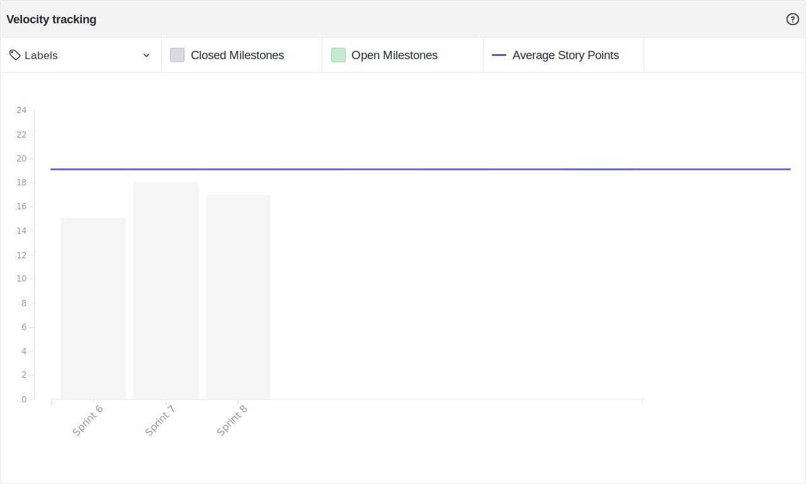

# Resultado Sprint 8

## Sprint Backlog

### Pontuação da Sprint

**Pontos planejados:** 20 pontos  
**Pontos concluídos:** 17 pontos  
**Dívidas geradas:** 3 pontos  

### Issues Entregues

- [#82 Documentar Sprint 8](https://github.com/fga-eps-mds/2019.2-FoodCare/issues/82) - 2 pontos
- [#73 Refatorar Documentos de Produto](https://github.com/fga-eps-mds/2019.2-FoodCare/issues/73) - 8 pontos
- [#75 Configurar PWA](https://github.com/fga-eps-mds/2019.2-FoodCare/issues/75) - 3 pontos
- [#79 Configurar cobertura de testes na API](https://github.com/fga-eps-mds/2019.2-FoodCare/issues/79) - 2 pontos
- [#78 Configurar cobertura de testes no WebAPP](https://github.com/fga-eps-mds/2019.2-FoodCare/issues/78) - 2 pontos

### Dividas técnicas

- [#74 Criar documento ROI](https://github.com/fga-eps-mds/2019.2-FoodCare/issues/71) - 3 pontos

## Retrospectiva da Sprint

### Pontos Positivos

- Os documentos foram atualizados para o novo escopo
- PWA configurado com sucesso!
- Repositórios prontos para receber testes unitários

### Pontos Negativos

- PO com dificuldades para concluir o ROI
- Baixo conhecimento da equipe à respeito de testes unitários
- Outras matérias tirando o foco da equipe

### Sugestão de melhoria

- Estudos sobre testes unitários

## Burndown

Foram 20 pontos planejados nessa sprint, e 17 pontos foram entregues, gerando apenas 3 pontos de dívida técnica.

## Velocity

Foram 17 pontos entregues nessa sprint, 1 a menos do que a sprint passada, e a média do velocity caiu de 19,25 para 19,00.

## Quadro de Conhecimento

Houveram algumas mudanças no quadro de conhecimento, a equipe MDS têm aprendido cada vez mais à respeito de como funcionam as APIs e as requisições feitas com o frontend.

## Análise do Scrum Master

Essa sprint teve como objetivo principal o término das dívidas técnicas da sprint anterior, e também se concentra em configurações da cobertura de testes nos repositórios do projeto.

Nessa sprint houveram menos dívidas técnicas geradas, porém a quantidade de pontos concluídos foi 1 ponto a menos que na última sprint, o que mostra uma estagnação na produtividade da equipe. O que é preocupante, pois para cumprir o combinado no roadmap, a equipe precisará produzir mais do que está produzindo.

Planejar uma quantidade de pontos mais próximo da média do velocity mostrou ser útil para diminuir a quantidade de dívida gerada, porém não houve aumento na produtividade. Alguns membros tiveram provas de outras matérias, então foi decidido que todos iriam se ajudar para finalizar as dívidas das sprints anteriores, e que não haveria o desenvolvimento de novas features nessa sprint.
