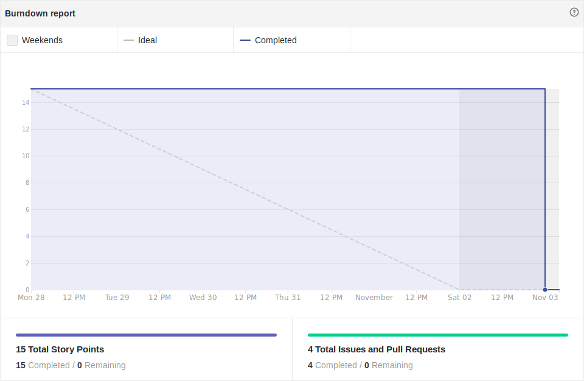
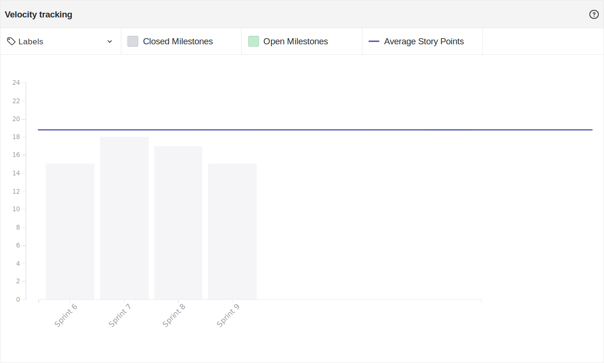
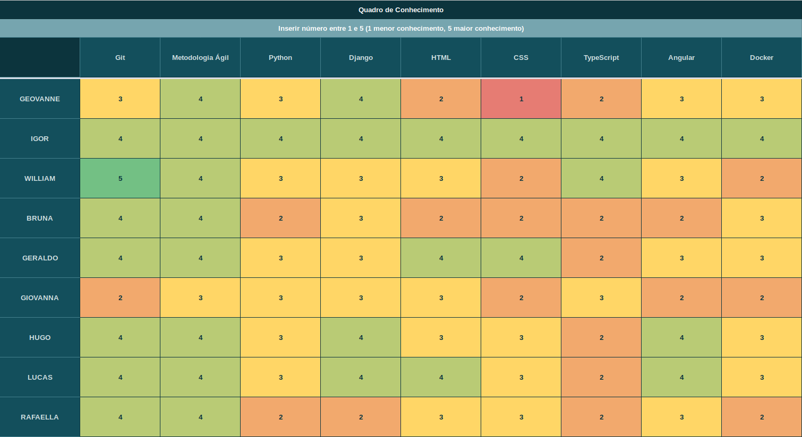

# Resultado Sprint 9

## Sprint Backlog

### Pontuação da Sprint

**Pontos planejados:** 26 pontos  
**Pontos concluídos:** 15 pontos  
**Dívidas geradas:** 11 pontos  

### Issues Entregues

- [#83 Documentar Sprint 9](https://github.com/fga-eps-mds/2019.2-FoodCare/issues/83) - 2 pontos
- [#84 Ordenar e Pesquisar Eventos](https://github.com/fga-eps-mds/2019.2-FoodCare/issues/84) - 5 pontos
- [#85 Conectar Evento ao Doador](https://github.com/fga-eps-mds/2019.2-FoodCare/issues/85) - 5 pontos
- [#74 Criar documento ROI](https://github.com/fga-eps-mds/2019.2-FoodCare/issues/71) - 3 pontos

### Dividas técnicas

- [#86 Gerenciar Perfil de Doadores](https://github.com/fga-eps-mds/2019.2-FoodCare/issues/86) - 8 pontos
- [#87 Dojo de testes](https://github.com/fga-eps-mds/2019.2-FoodCare/issues/87) - 3 pontos

## Retrospectiva da Sprint

### Pontos Positivos

- Fechamento de mais duas features

### Pontos Negativos

- Dívida técnica de mais uma feature
- Produtividade em queda
- Dificuldades na gestão de tempo pessoal dos membros equipe
- Problemas no entendimento da model User do Django

### Sugestão de melhoria

- Estudos sobre testes unitários
- Organizar melhor o tempo, eliminando chaveamentos

## Burndown

Foram 26 pontos planejados nessa sprint, e 15 pontos foram entregues, gerando 11 pontos de dívida técnica.

## Velocity

Foram 15 pontos entregues nessa sprint, 2 a menos do que a sprint passada, e a média do velocity caiu de 19,00 para 18,60.

## Quadro de Conhecimento

Não houveram maiores mudanças no quadro de conhecimento.

## Análise do Scrum Master

Essa sprint teve como objetivo principal a continuação do desenvolvimento do software, após o realinhamento do escopo e refatoração de documentos.

A quantidade de pontos entregues pelo grupo está em queda por 2 sprints seguidas, isso se deve à dificuldade de gestão de tempo pessoal dos membros da equipe em si.

Foi sugerido, na sprint passada, que houvesse mais dedicação à respeito de testes unitários, e foi planejado que houvesse um dojo de testes nessa sprint, porém o dojo não foi realizado nessa sprint, pois a reunião não pôde ser feita na sprint em questão, se tornando dívida técnica.