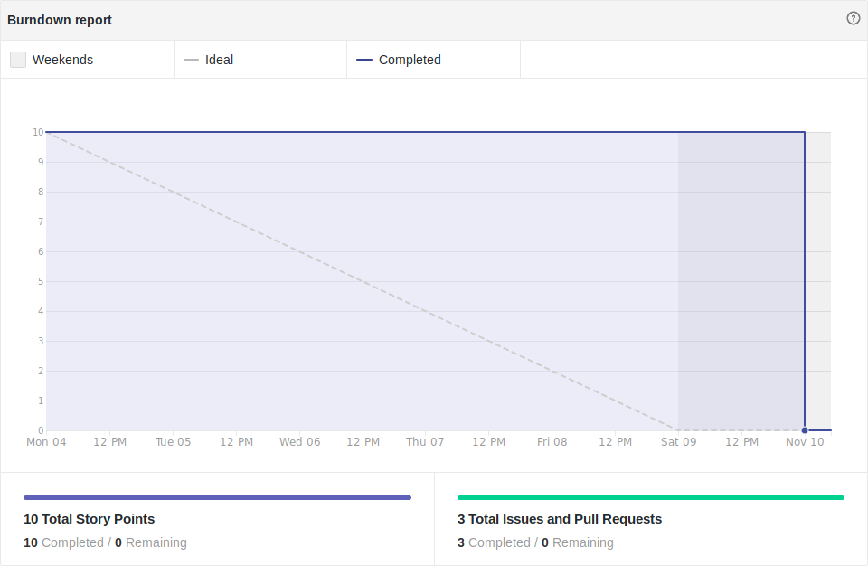
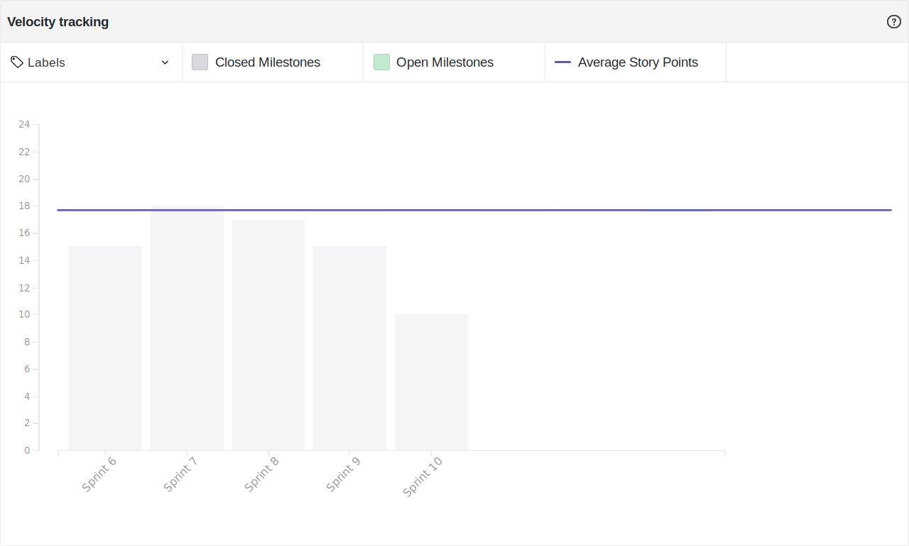

# Resultado Sprint 10

## Sprint Backlog

### Pontuação da Sprint

**Pontos planejados:** 26 pontos  
**Pontos concluídos:** 10 pontos  
**Dívidas geradas:** 16 pontos  

### Issues Entregues

- [#93 Documentar Sprint 10](https://github.com/fga-eps-mds/2019.2-FoodCare/issues/93) - 2 pontos
- [#87 Dojo de testes](https://github.com/fga-eps-mds/2019.2-FoodCare/issues/87) - 3 pontos
- [#95 Adicionar Categoria](https://github.com/fga-eps-mds/2019.2-FoodCare/issues/95) - 5 pontos

### Dividas técnicas

- [#94 Configurar Localização](https://github.com/fga-eps-mds/2019.2-FoodCare/issues/94) - 8 pontos
- [#86 Gerenciar Perfil de Doadores](https://github.com/fga-eps-mds/2019.2-FoodCare/issues/86) - 8 pontos

## Retrospectiva da Sprint

### Pontos Positivos

- Melhor entendimento da equipe à respeito de testes unitários
- Aumento da cobertura de testes

### Pontos Negativos

- Backlog deveria ter sido finalizado nessa sprint
- Gerenciar perfil permanece como dívida
- Dificuldades com a model User do Django
- Dificuldades com as requisições do user do frontend

### Sugestão de melhoria

- Usar mais o stackoverflow
- Perguntar no grupo quando tiver dúvida.
- Mais reuniões presenciais para resolução de dúvidas

## Burndown

Foram 26 pontos planejados nessa sprint, e 10 pontos foram entregues, gerando 16 pontos de dívida técnica.

## Velocity

Foram 10 pontos entregues nessa sprint, 5 a menos do que a sprint passada, e a média do velocity caiu de 18,60 para 17,82.

## Quadro de Conhecimento

Não houveram maiores mudanças no quadro de conhecimento.

## Análise do Scrum Master

Essa sprint teve como objetivo principal finalizar as features do projeto, para dar espaço às analises e testes do software desenvolvido. Porém, duas features permaneceram como dívida técnica, gerando atraso para as próximas sprints.

A dupla responsável pela issue 86, Gerenciar Perfil de Doadores, está tendo dificuldades para compreender a utilização da model User, que vem por padrão no Django, e isso resultou na segunda dívida técnica da mesma feature. Houveram confusões em pesquisas à respeito dos assuntos das features que viraram dívida técnica, em muitos dos casos, uma pesquisa no google, ou uma pergunta no grupo, pouparia um bom tempo, conforme mostrado à equipe MDS em uma reunião presencial.

A equipe toda se aprofundou em testes unitários, e obtivemos bons resultados através do dojo realizado, a cobertura de testes aumentou tanto no backend, quanto no frontend.
