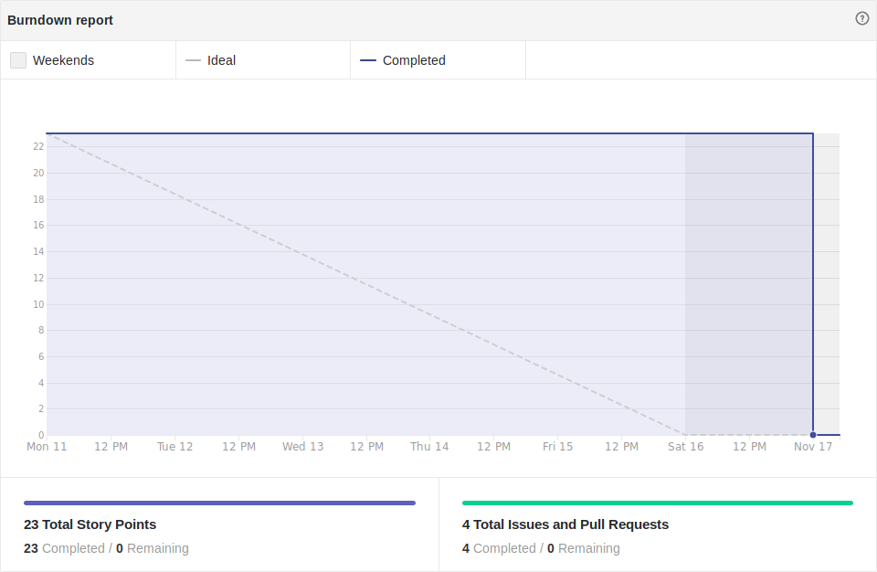
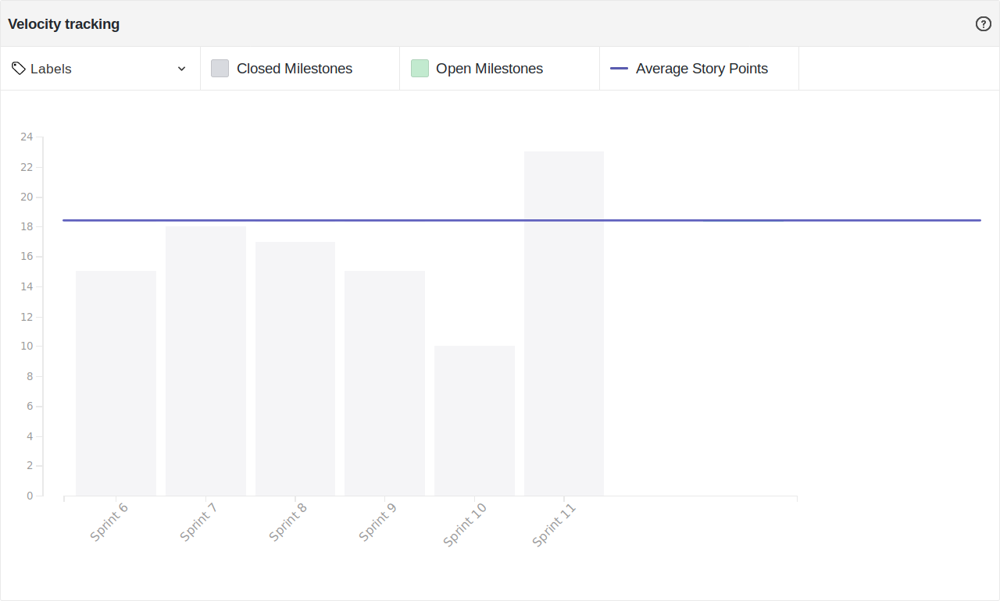

# Resultado Sprint 11

## Sprint Backlog

### Pontuação da Sprint

**Pontos planejados:** 23 pontos  
**Pontos concluídos:** 23 pontos  
**Dívidas geradas:** 0 pontos  

### Issues Entregues

- [#98 Documentar Sprint 11](https://github.com/fga-eps-mds/2019.2-FoodCare/issues/98) - 2 pontos
- [#86 Gerenciar Perfil de Doadores](https://github.com/fga-eps-mds/2019.2-FoodCare/issues/86) - 8 pontos
- [#94 Configurar Localização](https://github.com/fga-eps-mds/2019.2-FoodCare/issues/94) - 8 pontos
- [#99 Configurar Deploy do Backend](https://github.com/fga-eps-mds/2019.2-FoodCare/issues/99) - 5 pontos

### Dividas técnicas

Não houveram dívidas técnicas, todas histórias foram entregues.

## Retrospectiva da Sprint

### Pontos Positivos

- Todas as histórias foram entregues!
- Deploy do backend funcionando!
- Aumento na produtividade 
- Reuniões presenciais fizeram a diferença

### Pontos Negativos

Nenhum.

### Sugestão de melhoria

- Vamo manter isso aí. (Manter as reuniões presenciais)

## Burndown

Foram 23 pontos planejados nessa sprint, e todos os 23 pontos foram entregues, não havendo dívidas técnicas geradas, nessa sprint.

## Velocity

Foram 23 pontos entregues nessa sprint, 13 a mais do que a sprint passada, e a média do velocity subiu de 17,82 para 18,25.

## Quadro de Conhecimento

Não houveram maiores mudanças no quadro de conhecimento.

## Análise do Scrum Master

Essa sprint teve como objetivo a finalização de dívidas técnicas e estudo de testes unitários. O DevOps ficou responsável por concluir o deploy do backend.

Nessa sprint não houveram dívidas técnicas, resultado do empenho da equipe e das reuniões presenciais que aconteceram ao longo da semana.
