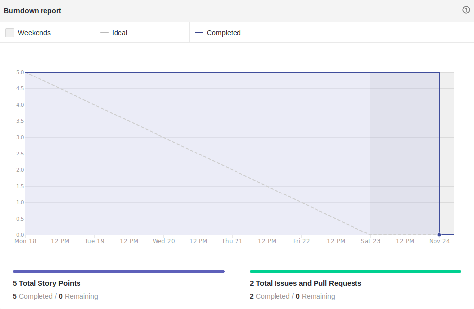
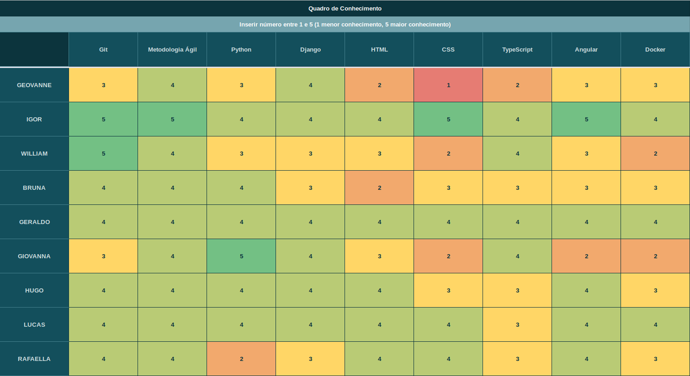

# Resultado Sprint 12

## Sprint Backlog

### Pontuação da Sprint

**Pontos planejados:** 21 pontos  
**Pontos concluídos:** 5 pontos  
**Dívidas geradas:** 16 pontos  

### Issues Entregues

- [#104 Documentar Sprint 12](https://github.com/fga-eps-mds/2019.2-FoodCare/issues/104) - 2 pontos
- [#107 Ajustar permissões das models](https://github.com/fga-eps-mds/2019.2-FoodCare/issues/107) - 3 pontos

### Dividas técnicas

- [#63 Elaborar EVM](https://github.com/fga-eps-mds/2019.2-FoodCare/issues/63) - 3 pontos
- [#105 Aumentar cobertura de testes](https://github.com/fga-eps-mds/2019.2-FoodCare/issues/105) - 5 pontos
- [#106 Ajustar design e validações do front](https://github.com/fga-eps-mds/2019.2-FoodCare/issues/106) - 8 pontos

## Retrospectiva da Sprint

### Pontos Positivos

- Aumento do conhecimento sobre testes
- Ar condicionado funcionando no container de estudos

### Pontos Negativos

- Queda de produtividade, devido à semana de provas
- Container de estudos só fica aberto até 18h30

### Sugestão de melhoria

- Estudo sobre testes unitários
- Estudo sobre form validators

## Burndown

Foram 21 pontos planejados nessa sprint, e 5 pontos foram entregues, gerando 16 pontos de dívida técnica.

## Velocity

Foram 5 pontos entregues nessa sprint, 18 a menos do que a sprint passada, e a média do velocity caiu de 18,25 para 17,23.

## Quadro de Conhecimento

Houveram algumas mudanças no quadro de conhecimento, próximo da release 2, a equipe MDS teve uma evolução tardia, porém alguns se destacaram no conhecimento à respeito das tecnologias.

## Análise do Scrum Master

Essa sprint teve como objetivo a melhoria do software desenvolvido, através de testes, validações e refatorações.

Como podemos ver através das métricas, houve uma queda considerável na produtividade, e isso se deve ao fato de alguns membros de MDS e EPS estarem focados na entrega de trabalhos, ou na realização de provas de outras matérias. Alguns membros tiveram a oportunidade de se aprofundar no conteúdo de suas issues, porém as dívidas técnicas foram inevitáveis.
