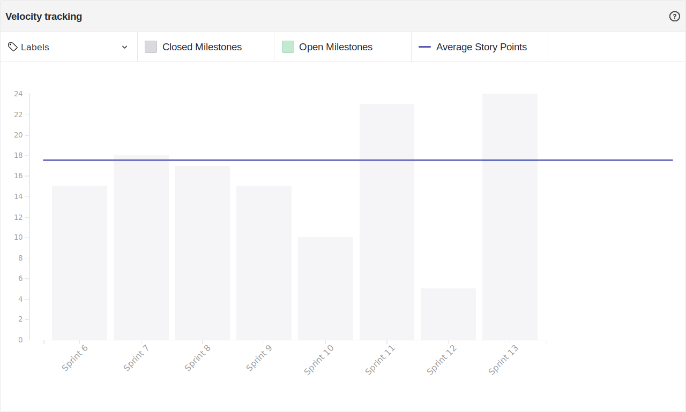

# Resultado Sprint 13

## Sprint Backlog

### Pontuação da Sprint

**Pontos planejados:** 24 pontos  
**Pontos concluídos:** 24 pontos  
**Dívidas geradas:** 0 pontos  

### Issues Entregues

- [#110 Documentar Sprint 13](https://github.com/fga-eps-mds/2019.2-FoodCare/issues/110) - 2 pontos
- [#111 Montar apresentação da R2](https://github.com/fga-eps-mds/2019.2-FoodCare/issues/111) - 3 pontos
- [#112 Criar Postmortem R2](https://github.com/fga-eps-mds/2019.2-FoodCare/issues/112) - 3 pontos
- [#63 Elaborar EVM](https://github.com/fga-eps-mds/2019.2-FoodCare/issues/63) - 3 pontos
- [#105 Aumentar cobertura de testes](https://github.com/fga-eps-mds/2019.2-FoodCare/issues/105) - 5 pontos
- [#106 Ajustar design e validações do front](https://github.com/fga-eps-mds/2019.2-FoodCare/issues/106) - 8 pontos

### Dividas técnicas

Não houveram dívidas técnicas, todas histórias foram entregues.

## Retrospectiva da Sprint

### Pontos Positivos

- ACABOOOOUUUU! (Features finalizadas)
- Aumento na produtividade

### Pontos Negativos

Nenhum.

## Burndown

<!--  -->

Foram 24 pontos planejados nessa sprint, e todos os 24 pontos foram entregues, não havendo dívidas técnicas geradas para o final do projeto.

## Velocity

Foram 24 pontos entregues nessa sprint, 19 a mais do que a sprint passada, e a média do velocity subiu de 17,23 para 17,71.

## Quadro de Conhecimento

Não houveram maiores mudanças no quadro de conhecimento.

## Análise do Scrum Master

Essa sprint teve como objetivo terminar a melhoria do software desenvolvido, e criar documentos que resumam as ações do grupo durante o projeto e as funcionalidades do produto.

No final do projeto, todo mundo aparece e a produtividade vai lá pra cima. Dessa vez não foi diferente, a equipe conseguiu entregar todos os pontos planejados, e finalizar o projeto na última sprint. 
