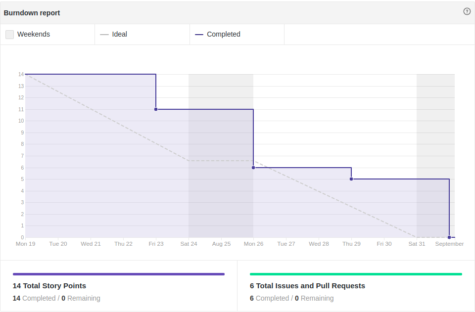

# Fechamento da Sprint 0

## 1- Resumo da Sprint

##### Pontos concluídos: 14 pontos

- Histórias Entregues:

- [#1 Adicionar templates de issues e pull requests](https://github.com/fga-eps-mds/2019.2-Grupo7/issues/1)

- [#2 Dojo: Fundamentos Git](https://github.com/fga-eps-mds/2019.2-Grupo7/issues/2)

- [#4 Dojo: Metodologia Ágil-Scrum](https://github.com/fga-eps-mds/2019.2-Grupo7/issues/4)

- [#5 Configurar ZenHub](https://github.com/fga-eps-mds/2019.2-Grupo7/issues/5)

- [#6 Configurar GitPages](https://github.com/fga-eps-mds/2019.2-Grupo7/issues/6)

- [#7 Definir política de contribuição](https://github.com/fga-eps-mds/2019.2-Grupo7/issues/7)

Pode-se observar que todas as histórias previstas na Sprint foram entregues, devido a baixa complexidade, relacionadas a treinamento e organização do grupo.

## 2- Retrospectiva da sprint
|**Pontos Positivos**|**Pontos Negativos**|**Sugestão de melhoria**|
|---|---|---|
|Formação e integração do grupo|Entrega tardia do tema do projeto|equipe(MDS) olhar repositórios de trabalhos anteriores, para se familiarizarem com as documentações|
|Definição do tema confortável para todos|sprint 0 com término de mais de 2 semanas|---|
|Transferência inicial de conhecimento bastante produtiva|não ter seguida a metodologia Scrum a risca(dailymeeting, reunião de término de Sprint)|---|
|Visão inicial do que o produto pode ser|---|---|

## 3- Quadro de conhecimento

Este quadro mostra o conhecimento inicial de cada membro do grupo em cada área abordada no Sprint 0, que foi o git e a metodologia ágil, vemos que boa parte de mds nunca tinha lidado com o Scrum e tinham pouco contato com git. As outras áreas serão preenchidas nas próximas sprints, quando ocorrerá o treinamento e estudo individual de cada coluna.

## 4- Burndown

Percebe-se no gráfico que todas as histórias foram entregues, e as issues da Sprint foram executadas no decorrer de todo sua duração.

## 5- Velocity

Como esta foi a Sprint 0, o velocity desta Sprint não pôde ser comparado com outros para determinar como está o desempenho da equipe, mas servirá como ponto de partida para os outros que virão futuramente.

## Análise do Scrum Master

Esta Sprint teve como objetivo fazer com que os integrantes de MDS e EPS tivessem o primeiro contato, que também pudéssemos saber da especialidade técnica de cada um, para que quando o tema do projeto fosse dado o time de eps pudesse tomar a melhor estratégia possível.

Na questão de passagem de conhecimento, foi bem produtivo os dojos, a metodologia de desenvolvimento junto com o git foi absorvido de maneira positiva pela equipe de MDS, teve um problema, mais tecnologias não puderam ser passadas justamente pela demora na definição dos temas de cada grupo.
