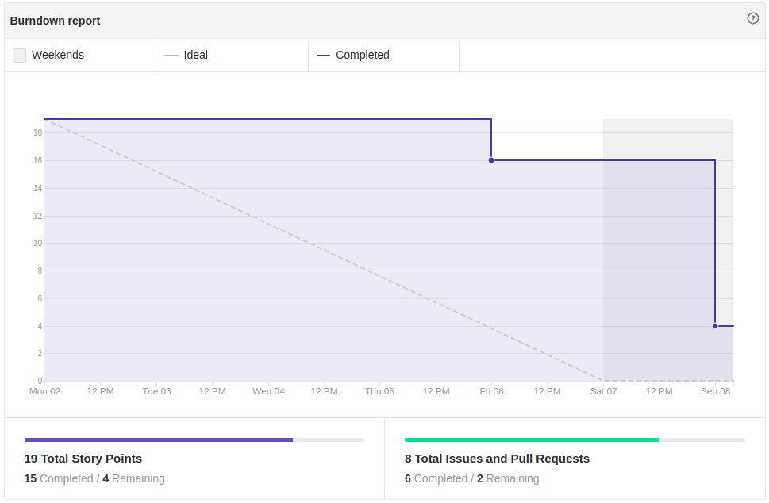
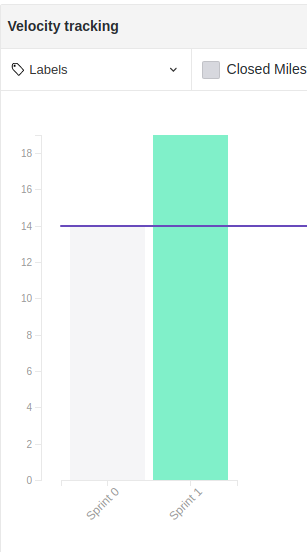

# Fechamento da Sprint 1

## 1- Resumo da Sprint

##### Pontos concluídos: 15 pontos de 19 planejados

- Histórias Entregues:

- [#1 Criar documento de visão](https://github.com/fga-eps-mds/2019.2-FoodCare/issues/10)

- [#2 Criar documento da metodologia](https://github.com/fga-eps-mds/2019.2-FoodCare/issues/12)

- [#3 Criar protótipo de baixa fidelidade](https://github.com/fga-eps-mds/2019.2-FoodCare/issues/18)

- [#5 Estudar python](https://github.com/fga-eps-mds/2019.2-FoodCare/issues/19)

- [#6 Estudar Django](https://github.com/fga-eps-mds/2019.2-FoodCare/issues/19)

- [#7 Dojo de documentação](https://github.com/fga-eps-mds/2019.2-FoodCare/issues/14)

- [#9 Criar Mapa Mental](https://github.com/fga-eps-mds/2019.2-FoodCare/issues/17)

- Histórias Não Entregues:

- [#8 Criar TAP](https://github.com/fga-eps-mds/2019.2-FoodCare/issues/16)

- [#10 Iniciar Projeto](https://github.com/fga-eps-mds/2019.2-foodcare/issues/15)

Pode-se observar que duas histórias não foram entregue, e novamente a produção da equipe foi regular devido ser uma sprint de documentação e estudo de tecnologia, o fato de termos gastado muito tempo na decisão da arquitetura do projeto influenciou para que a issue de inicio do projeto virasse débito técnico.

## 2- Retrospectiva da sprint
|**Pontos Positivos**|**Pontos Negativos**|**Sugestão de melhoria**|
|---|---|---|
|Maior comunicação e entrosamento entre a equipe|Issues sendo fechadas na data errada|equipe(MDS) olhar repositórios de trabalhos anteriores, para se familiarizarem com as documentações|
|Definição das tecnologias que serão usasdas no projeto, inclusive a arquitetura|Teve uma demora no planejamento da sprint 1|Melhor gerenciamento das issues|
|Os desenvolvedores(mds) já estão estudando as linguagens|---|---|
|A visão do escopo ficou mais robusta, com o documento de visão e protótipo de baixa fidelidade|---|---|

## 3- Quadro de conhecimento

Este quadro aborda o conhecimento depois de 2 semanas de projeto, ou duas sprints, houve um considerável aumento dessa tabela, pois com as tecnologias e arquitetura decididas o quadro teve de ser atualizado, inicialmente a maioria dos espaços estão em vermelho, mas a tendência é o conhecimento se nivelar e aumentar progressivamente, com os dojos e estudos individuais.

## 4- Burndown

Percebe-se que pela falta de administração no fechamento das issues no tempo certom, afetou o gráfico burndown, mesmo que as issues estivessem sendo feitas progressivamente durante a semana, duas issues ficaram sem ser resolvidas e viraram débito técnico, muito devido essa sprint 1 também ser atípica, pelo fato de estarmos decidindo arquitetura e linguagens.

## 5- Velocity

O velocity mostra que aumentou o número de pontos planejados, porém os pontos concluídos foram 1 a mais que na anterior, só que as issues ficaram mais elaboradas e direcionadas para o escopo do projeto.

## Análise do Scrum Master

Esta Sprint teve como objetivo decidirmos a tecnologia e arquitetura que será utilizada, além de validarmos os requisitos do projeto com clientes reais, a equipe com uma reunião elaborou o primeiro protótipo e mapa mental, o que fez com que todos os membros da equipe tivessem já a noção do que seria criado, e isso foi exercitado com o desenvolvimento do documento de visão. Na questão de conhecimento, todos começaram os estudos individuais. Esta Sprint foi bem difícil, porque exigiu um planejamento bem pensado e demorado, pelas decisões de projeto que tivemos que tomar.
