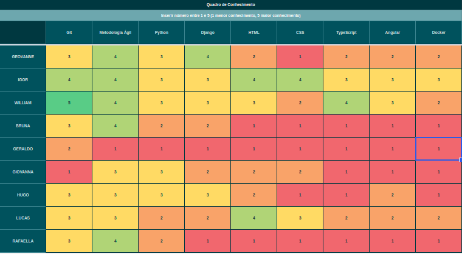
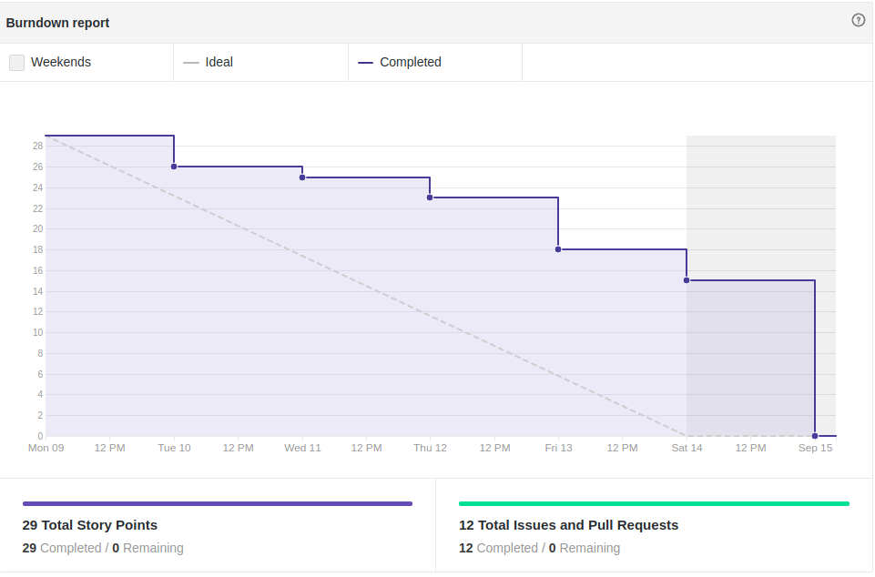
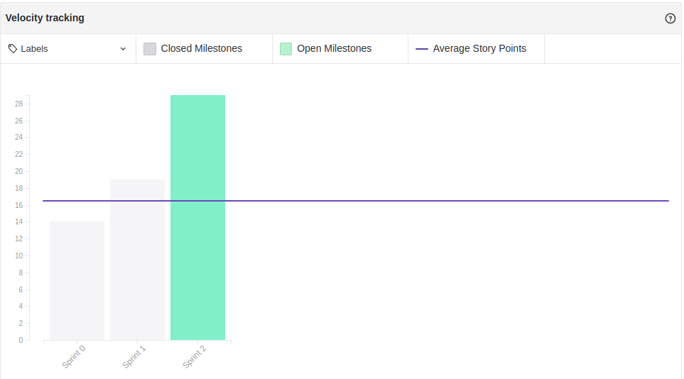

# Fechamento da Sprint 2

## 1- Resumo da Sprint

##### Pontos concluídos: 29 pontos

- Histórias Entregues:

- [#1 Criar protótipo de alta fidelidade](https://github.com/fga-eps-mds/2019.2-FoodCare/issues/28)

- [#2 Estudar django](https://github.com/fga-eps-mds/2019.2-FoodCare/issues/30)

- [#3 Estudar angular](https://github.com/fga-eps-mds/2019.2-FoodCare/issues/30)

- [#4 Dojo de Django e Angular](https://github.com/fga-eps-mds/2019.2-FoodCare/issues/30)

- [#5 Criar Tap](https://github.com/fga-eps-mds/2019.2-FoodCare/issues/16)

- [#6 Criar Docker](https://github.com/fga-eps-mds/2019.2-FoodCare/issues/27)

- [#7 Criar Canvas](https://github.com/fga-eps-mds/2019.2-FoodCare/issues/22)

- [#8 Criar EAP](https://github.com/fga-eps-mds/2019.2-FoodCare/issues/24)

- [#9 Criar roadmap de papeis](https://github.com/fga-eps-mds/2019.2-FoodCare/issues/26)

- [#10 Criar roadmap de produto](https://github.com/fga-eps-mds/2019.2-FoodCare/issues/25)

- [#11 Criar folha de estilo](https://github.com/fga-eps-mds/2019.2-FoodCare/issues/29)

- [#12 instalar o Travis](https://github.com/fga-eps-mds/2019.2-FoodCare/issues/31)

- Histórias Não Entregues:
Nenhuma.

Pode-se observar que todas as histórias foram entregues, com mais artefatos da equipe de EPS, nessa Sprint o time de MDS ficou com a parte de criar o protótipo de alta fidelidade, também tiveram que estudar sobre a arquitetura do projeto para o dojo de arquitetura que aconteceu sexta.

## 2- Retrospectiva da sprint
|**Pontos Positivos**|**Pontos Negativos**|**Sugestão de melhoria**|
|---|---|---|
|Aumento de produtividade da equipe|Equipe de MDS ficou bem perdida no começo da Sprint|equipe(MDS) olhar repositórios de trabalhos anteriores, para se familiarizarem com as documentações|
|Com o protótipo já sabemos com mais clareza o que o produto virá a ser|Ainda não começamos a mexer com recursos funcionais|Fazer reunião de planejamento e planning poker com a equipe de MDS |
|Ouvir mais a equipe de MDS e seus reviews da Sprint|---|Colocar os pareamentos pro desenvolvimento de requisitos funcionais|
|---|---|Identificar possíveis riscos para a próxima Sprint|

## 3- Quadro de conhecimento

Este quadro aborda o conhecimento depois de três sprints, houve um considerável aumento no conhecimento de django e do entendimento da arquitetura, [tabela de horas trabalhadas](https://docs.google.com/spreadsheets/d/1NrR6Oh-tJsaAimDdOja_gvTsL-g2F_3fklMY8SX_2AQ/edit#gid=644793269), por esta tabela dá para perceber que a equipe de MDS focou no aprendizado da API "Django Rest" o que ajudará no planejamento da sprint 3, em relação aos tópicos de estudo e distribuição de atividades.

## 4- Burndown

Foram 29 pontos planejados, com todos os pontos sendo concluídos até o final da Sprint. Devido a equipe de MDS ter ficado um pouco perdida no começo da Sprint, e não terem visto o documento de planejamento da sprint 2 no dia que foi lançado no git, a maior issue que é o protótipo de alta fidelidade foi começar a ser desenvolvida quinta-feira, trazendo um risco e exigindo maior horas de trabalho no final de semana.

## 5- Velocity

Essa Sprint foi um teste para o quanto a equipe de MDS e EPS poderiam produzir numa Sprint, o aumento progressivo de pontos está sendo feito para que possamos chegar na produtividade máxima da equipe, e com isso saber o quanto podemos puxar de cada membro da equipe.

## Análise do Scrum Master

Essa Sprint teve como objetivo principal a criação do protótipo de alta fidelidade e do estudo da arquitetura, pois com isso sabemos como as páginas do site serão e também como os componentes de front-end, api e bancos se comunicam, e esse entendimento é fundamental para a implementação de requisitos funcionais, que já começará na Sprint 3. Como pontos negativo ouve falta de comunicação, gerando desconforto na equipe de MDS até o segundo dia da Sprint, os conselhos foram ouvidos, entre eles fazer o planejamento e um planning poker com mais tempo para que não haja mais dúvidas do que deve ser feito.
