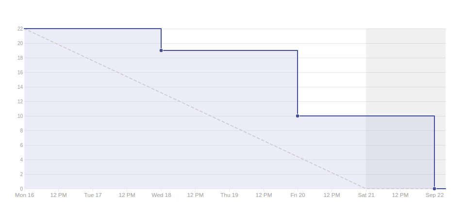

# Resultado Sprint 3

## Sprint Backlog

### Pontuação da Sprint

**Pontos planejados:** 40 pontos  
**Pontos concluídos:** 22 pontos  
**Dívidas geradas:** 18 pontos  

### Issues Entregues

- [#38 Documentar Sprint 3](https://github.com/fga-eps-mds/2019.2-Grupo7/issues/38) - 2 pontos
- [#39 Criar README](https://github.com/fga-eps-mds/2019.2-Grupo7/issues/39) - 1 ponto
- [#42 Criar Documento de Arquitetura](https://github.com/fga-eps-mds/2019.2-Grupo7/issues/42) - 8 pontos
- [#44 Criar Backlog do Produto](https://github.com/fga-eps-mds/2019.2-Grupo7/issues/44) - 3 pontos
- [#45 Criar Pipeline de Deploy Contínuo](https://github.com/fga-eps-mds/2019.2-Grupo7/issues/45) - 2 pontos
- [#46 Criar Plano de Gerenciamento de Riscos](https://github.com/fga-eps-mds/2019.2-Grupo7/issues/46) - 5 pontos
- [#47 Criar Documento de Ferramentas](https://github.com/fga-eps-mds/2019.2-Grupo7/issues/47) - 1 ponto

### Dividas técnicas

- [#40 Criar Home](https://github.com/fga-eps-mds/2019.2-Grupo7/issues/40) - 8 pontos
- [#41 Criar Cadastro e Login de Doador](https://github.com/fga-eps-mds/2019.2-Grupo7/issues/41) - 8 pontos
- [#43 Criar Termo de Compromisso](https://github.com/fga-eps-mds/2019.2-Grupo7/issues/43) - 2 pontos

## Retrospectiva da Sprint

### Pontos Positivos

- As documentações de mds foram finalizadas
- A equipe está se esforçando para aprender a tecnologia
- O review foi bastante interessante, deu para perceber a dificuldade que cada mds estava tendo

### Pontos Negativos

- Equipe de MDS teve muita dificuldade para rodar o Docker
- Requisitos funcionais viraram dívida técnica
- Equipe de mds ainda tem algumas dúvidas em relação a arquitetura
- O pareamento aconteceu poucas vezes, pois eles acabaram tentando fazer sua parte sozinha

### Sugestão de melhoria

- Equipe MDS utilizar a técnica do pareamento, para compartilhar conhecimento
- Tentar resolver as issues de código desde o primeiro dia da sprint

## Burndown

Foram 40 pontos planejados, onde desses 40, foram entregues 22. Mesmo com alguns tutoriais para fixar o aprendizado e supervisão dos EPS, houveram muitas dúvidas na hora de programar, essa foi a primeira Sprint com código, no qual eles tiveram que parear e mexer tanto na API quanto no Angular, para montagem das telas, a falta do costume de programar todos dias também interferiu para que todas as issues fossem entregues, e que não surgissem dívidas técnicas, em relação a documentação, a produção foi regular e não houve muitos problemas.

## Velocity

Apesar do planejamento ter aumentado o número de pontos da Sprint 2 para a Sprint 3, o número entregue foi menos, ocorrendo uma queda no Velocity, agora antes de planejarmos uma Sprint com um número maior de pontos, e com issues mais difíceis, temos que ter certeza de que a equipe de MDS tem base técnica para a solução de tais funções. Assim podemos chegar num Velocity saudável e mantenha as entregas bem regulares e padronizadas.

## Quadro de Conhecimento

Este quadro aborda o conhecimento depois de quatro sprints, vemos que todos já sabem a metodologia, a parte de backend o desenvolvimento está em crescimento, o maior problema são com as tecnologias relacionadas ao Angular, onde a maioria dos membros tem dificuldade, e isso faz com que ao final da sprint as issues funcionem em partes, mas o todo não é entregue, pela tabela dá para perceber que a equipe de MDS que pegou a issue de home, que foram Rafaella, Geraldo e Lucas, tiveram algumas horas com foco no Angular, houve umas disseminação de conhecimento, inclusive pela descrição das horas trabalhadas deu para perceber isso.

<!-- ## Burndown de Risco

Esse tópico faz com que possamos analisar todos os possíveis riscos de cada Sprint, e ver como esses riscos se comportam conforme as Sprints vão passando, vendo se as ações para diminuir os pontos por riscos e a maturidade da equipe criam uma queda progressiva das linhas do gráfico. Nesse primeiro gráfico, os maiores riscos são a dificuldade da equipe de MDS com as tecnologias(Docker, Django Rest e Angular), a comunicação entre os membros, que é extremamente necessário para o pareamento ser um sucesso, e atraso nas entregas, por essa ser a primeira Sprint no qual MDS irá usar os conhecimentos dos DOJOS e estudos individuais para desenvolver os requisitos funcionais. -->

## Análise do Scrum Master

Essa Sprint tem como objetivo principal o fechamento do documento de arquitetura, e analisarmos como MDS se comportará em relação aos pareamentos, para que possamos rastrear as possíveis dificuldades, que podem ser que perdurem no futuro, a priorização dos requisitos funcionais foram baseados em issues de menos complexidade, na qual se acha bastante tutorial e material na internet, mas como esperado, mesmo com suporte a dificuldade no desenvolvimento foi grande, e o pareamento dos trios não foram executados todos os dias, devido a outras matérias que os MDS estão pegando ou por horário mesmo, mas vendo o quadro de horas e o de conhecimento, parece que o conhecimento de alguns foi disseminado para outros, e o grupo está mais preparado para a Sprint 4, para lidar com as issues.
