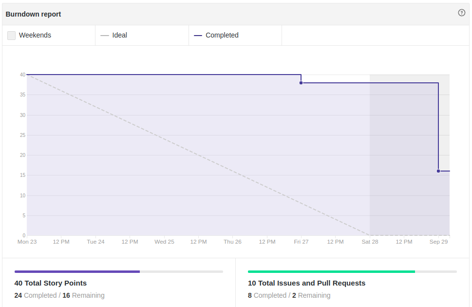
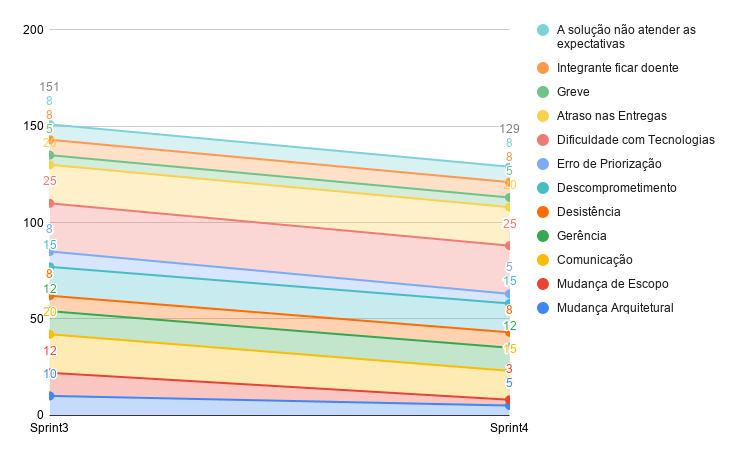

# Fechamento da Sprint 4

## 1- Resumo da Sprint
**Membros Presentes:** Geovanne, Lucas, Geraldo, Bruna, Rafaella e Giovanna.

##### Pontos concluídos: 24 pontos

- Histórias Entregues:

- [#40 Criar home](https://github.com/fga-eps-mds/2019.2-FoodCare/issues/40)

- [#53 Refatorar documentação](https://github.com/fga-eps-mds/2019.2-foodcare/issues/53)

- [#43 Criar termo de compromisso](https://github.com/fga-eps-mds/2019.2-FoodCare/issues/43)

- [#54 Criar plano de gerenciamento de qualidade](https://github.com/fga-eps-mds/2019.2-foodcare/issues/54)

- [#55 Criar código de conduta ](https://github.com/fga-eps-mds/2019.2-foodcare/issues/55)

- [#56 Criar guia de contribuição](https://github.com/fga-eps-mds/2019.2-foodcare/issues/56)

- [#52 Documentar Sprint 4](https://github.com/fga-eps-mds/2019.2-foodcare/issues/52)

- [#57 Criar especificação suplementar ](https://github.com/fga-eps-mds/2019.2-foodcare/issues/57)

- Histórias Não Entregues:

- [#41 Criar cadastro e login de doador](https://github.com/fga-eps-mds/2019.2-FoodCare/issues/41)

- [#51 Gerenciamento de evento](https://github.com/fga-eps-mds/2019.2-foodcare/issues/51)

Nessa Sprint praticamente mantivemos o número de pontos da Sprint passada, e o número de pontos entregue foi bem parecido com o da Sprint 3, mas nessa teve uma diferença, a primeira issue de código foi entregue, e as outras duas issues de código que não foram entregue estão encaminhadas.

## 2- Retrospectiva da sprint
|**Pontos Positivos**|**Pontos Negativos**|**Sugestão de melhoria**|
|---|---|---|
|A equipe se empenhou para entregar os requisitos funcionais|Dificuldade em conectar a request do Angular com o que a API tem de receber|Tentar resolver as issues de código desde o primeiro dia da sprint|
|A equipe de mds começou a realizar o pareamento da maneira certa, programando juntos|requisitos funcionais viraram dívida técnica|Fazer mais encontros presenciais para tentar solucionar os erros dos requisitos funcionais|
|Em relação aos problemas do código, deu pra perceber onde estava o erro e  deu para pensar numa solução para o erro que será executado na próxima sprint |Equipe de mds ainda tem algumas dúvidas em relação a arquitetura|Maior comunicação na hora de desenvolver as models, para que ela esteja modelada da melhor maneira|
|Equipe de mds está com cada vez menos problemas com Docker|---|---|

## 3- Quadro de conhecimento

Este quadro aborda o conhecimento depois de cinco sprints, vemos que todos já sabem a metodologia, a parte de backend o desenvolvimento está em crescimento, o maior problema são com as tecnologias relacionadas ao Angular, onde a maioria dos membros tem dificuldade, nessa como os pareamentos foram feitos mais vezes, e as issues envolvem tanto a api quanto o front, o conhecimento dos membros aumentaram, e isso faz com que nas próximas sprints toda a funcionalidade seja entregue, e não só um parte dela, [tabela de horas trabalhadas](https://docs.google.com/spreadsheets/d/1NrR6Oh-tJsaAimDdOja_gvTsL-g2F_3fklMY8SX_2AQ/edit#gid=1276363480), pelas horas trabalhadas percebe-se que algumas pessoas que estavam com foco no backend sprint passada, nessa sprint teve de focar no Angular devido a nova distribuição de atividades, fazendo com que o time fique cada vez mais full stack.

## 4- Burndown

Foram 40 pontos planejados, onde desses 40, foram entregues 24. Mesmo com alguns tutoriais para fixar o aprendizado e  supervisão dos EPS, houve muitas dúvidas na hora de programar(principalmente na hora de conseguir integrar o front com a api), essa foi a segunda Sprint com código, no qual eles tiveram que parear e mexer tanto na API quanto no Angular, dessa vez um requisito funcional foi entregue.

## 5- Velocity

Dessa vez decidimos manter o número de pontos planejados, e não aumentar mais os pontos para essa Sprint, devido as dívidas técnicas que poderiam dar trabalho, o Velocity se manteve regular, estamos cada vez mais chegando a um padrão saudável de produtividade, apesar que com a experiência maior da equipe os requisitos funcionais devem ser entregues com maior velocidade.

## 6- Burndown de Risco

Esse tópico faz com que possamos analisar todos os possíveis riscos de cada Sprint, e ver como esses riscos se comportam conforme as Sprints vão passando, os riscos diminuíram em relação a arquitetura, decisões de priorização e comunicação, mas dificuldade com tecnologia continua sendo o maior risco, as ações de aumento de pareamento, mais tutoriais e supervisão dos eps estão começando a surgir efeito e esse risco tende a cair daqui umas 2-3 Sprints.

## Análise do Scrum Master

Essa Sprint teve como objetivo principal focar nas dívidas técnicas, ver como as novas duplas de pareamento se comportam, como o quadro de conhecimento está evoluindo, pois agora o time de mds está cada vez mais focado nos requisitos funcionais, a parte de documentação foi refatorada em alguns tópicos, só que mais uma revisão será feita antes da release 1.  
A review da Sprint deu para identificar que mds está com dificuldade em integrar os dados do front com o que api recebe, logo soluções serão propostas para a sprint 5.
