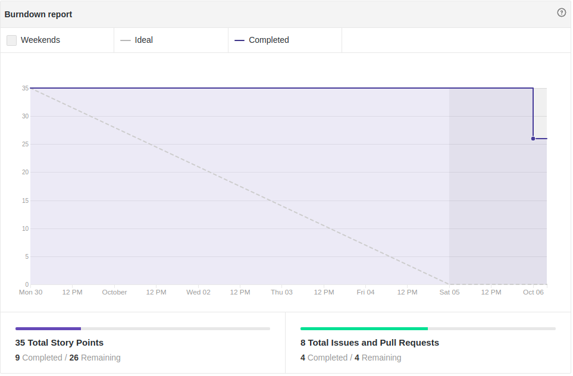
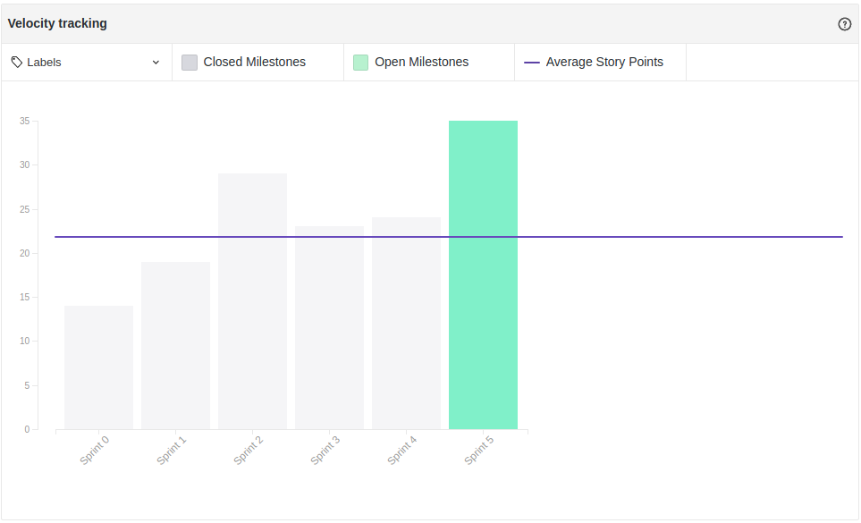

# Fechamento da Sprint 5

## 1- Resumo da Sprint
**Membros Presentes:** Geovanne, Geraldo, Bruna, Rafaella, Giovanna e Hugo.

##### Pontos concluídos: 9 pontos

- Histórias Entregues:

- [#59 Montar Apresentação Release 1](https://github.com/fga-eps-mds/2019.2-FoodCare/issues/59)

- [#60 Refatorar git pages](https://github.com/fga-eps-mds/2019.2-FoodCare/issues/60)

- [#58 Documentar Sprint 5](https://github.com/fga-eps-mds/2019.2-FoodCare/issues/58)

- [#63 Elaborar EVM](https://github.com/fga-eps-mds/2019.2-foodcare/issues/63)

- Histórias Não Entregues:

- [#41 Criar cadastro e login de doador](https://github.com/fga-eps-mds/2019.2-FoodCare/issues/41)

- [#51 Gerenciamento de evento](https://github.com/fga-eps-mds/2019.2-foodcare/issues/51)

- [#55 Entrar em Contato ](https://github.com/fga-eps-mds/2019.2-foodcare/issues/55)

- [#56 Deploy Continuo](https://github.com/fga-eps-mds/2019.2-foodcare/issues/56)

Nessa Sprint houve uma queda de pontos entregues, pois a parte de documentação já acabou, então sobrou os requisitos funcionais que estavam atrasados, mas mds ainda tem algumas dúvidas de como resolver os erros, ou passar no travis os pull requests.

## 2- Retrospectiva da sprint
|**Pontos Positivos**|**Pontos Negativos**|**Sugestão de melhoria**|
|---|---|---|
|A equipe está estudando e vendo as sugestões de soluções que eps dá nas issues de RF |Dificuldade em conectar a request do Angular com o que a API tem de receber|Tentar resolver as issues de código desde o primeiro dia da sprint|
|---|requisitos funcionais viraram dívida técnica|Fazer mais encontros presenciais para tentar solucionar os erros dos requisitos funcionais|
|---|Dificuldade em passar os PR no Travis|---|
|---|Falta de comunicação de mds, no quesito dúvidas no código, o que gerou baixa produtividade por essas dúvidas não terem sido colocadas com antecedência|---|

## 3- Quadro de conhecimento

Este quadro aborda o conhecimento depois de seis sprints, podemos observar um conhecimento médio da equipe de mds na parte do Angular, a api o conhecimento vem se espalhando pelos pareamentos, assim que todos os quadros mais para a direita estejam amarelos e verdes como os da esquerda, as dívidas técnicas irão se tornar cada vez menos frequentes e terá uma entrega contínua de funcionalidades.

## 4- Burndown

Foram 35 pontos planejados, onde desses 35, foram entregues 9. Mesmo com alguns tutoriais para fixar o aprendizado e  supervisão dos EPS, houve muitas dúvidas na hora de programar(principalmente na hora de passar os pull request pelo Travis), essa foi a terceira Sprint com código, a comunicação terá que ser feita de forma mais constante, mesmo que não haja dúvidas, a supervisão ocorrerá, para evitar que dúvidas de mds sejam acumuladas e que se tornem conhecidas somente no final da Sprint, e as dailys serão bem mais detalhadas .

## 5- Velocity

Novamente não aumentamos o número de pontos planejados, devido as dívidas técnicas que poderiam dar trabalho, o Velocity deu uma caída considerável, pois estamos indo pro segundo processo de entregas, que é o de código e a equipe está ainda ficando  madura na tecnologia.

## 6- Burndown de Risco

Esse tópico faz com que possamos analisar todos os possíveis riscos de cada Sprint, e ver como esses riscos se comportam conforme as Sprints vão passando, houve um aumento total dos riscos, pois por conselho da professora o escopo foi modificado, ou seja, foi reduzido, a risco da comunicação aumentou, devido as dificuldades de mds serem conhecidas somente no final da Sprint, e os outros tópicos se mantiveram como antes.

## Análise do Scrum Master
Essa Sprint teve como objetivo tentar terminar as dívidas técnicas e montar a apresentação da R1. Lições foram aprendidas, e isso vai nos ajudar a gerenciar melhor a Sprint 6, que será praticamente de código para mds, um outro fator será controlar as horas de trabalho, principalmente no tópico pareamento, para que possamos garantir que o conhecimento e a produção está sendo compartilhada.
